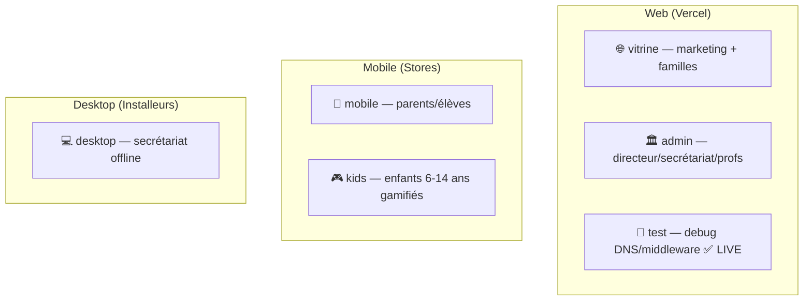

# PROJECT OVERVIEW — EduSmart

> **Conception et développement d'un système intégré de gouvernance scolaire et d'apprentissage adaptatif assisté par intelligence artificielle : plateforme EduSmart.**
>
> Mémoire de Master Informatique — Université Adventiste Zürcher (UAZ) — Randrianarison Dieu Donné.

---

## 1. Vision

**EduSmart** est une plateforme SaaS multi-tenant destinée aux établissements scolaires, conçue à l'origine pour répondre aux besoins des écoles malgaches (terrain pilote : **STRELITZIA SCHOOL**, Toamasina), puis pensée dès l'architecture pour être **adaptable à tout établissement** d'Afrique francophone et au-delà.

La plateforme sert à la fois :
- de **livrable académique** (mémoire de Master + soutenance),
- et de **produit déployable** en conditions réelles.

---

## 2. Problème adressé

Les écoles malgaches font face à :
- Une **gestion administrative fragmentée** (papier, Excel non partagés, classeurs locaux),
- Une **absence quasi-totale de visibilité côté parents** (notes connues trop tard, communication informelle),
- Une **détection tardive du décrochage scolaire** (souvent au moment des examens),
- Un **manque d'outils pédagogiques numériques** adaptés aux niveaux et au contexte local,
- Une **fracture numérique** : connectivité instable en zones rurales.

EduSmart répond avec un système intégré _online + offline + mobile_ couvrant administration, pédagogie, communication parents et apprentissage adaptatif.

---

## 3. Impacts visés (objectifs chiffrés)

| KPI | Cible |
|---|---|
| Temps moyen de génération des bulletins | **−70 %** |
| Détection précoce du décrochage scolaire | **80 %** des cas détectés **4 semaines avant** les examens |
| Adoption parents (% recevant les notes au plus tard 48h après saisie) | > 90 % |
| Continuité de service en zone non-connectée (desktop offline) | 100 % des opérations saisies → resync auto |

---

## 4. Utilisateurs cibles (6 rôles)

| Rôle | Surface d'usage | Périmètre de données |
|---|---|---|
| `super_admin` | `edusmart.site/admin` | Toutes les écoles (rôle réservé à l'auteur du mémoire) |
| `director` | `<slug>.edusmart.site/admin` | Sa propre école entièrement |
| `teacher` | `/admin/grades`, `/admin/quiz`, `/admin/ai-tools` | Ses classes uniquement |
| `secretary` | `/admin/students`, bulletins, inscriptions | Toute l'école sauf finances |
| `parent` | App mobile, `/dashboard` web | Ses enfants uniquement |
| `student` / `kid` | App mobile/kids, `/dashboard/student` | Son profil seul |

L'isolation entre rôles ET entre écoles est garantie par **Row-Level Security (RLS) PostgreSQL** appliquée systématiquement sur `organization_id`.

---

## 5. Périmètre — les 6 applications

| App | Tech | Distribution | Cible utilisateur |
|---|---|---|---|
| `vitrine` | Next.js 14 App Router | `*.edusmart.site` | Public, parents, futurs élèves, directeurs prospects |
| `admin` | Next.js 14 App Router | `*.edusmart.site/admin` | Directeurs, secrétariat, enseignants |
| `mobile` | Expo SDK 51 + Expo Router | App Store / Play Store | Parents, élèves collège/lycée |
| `kids` | Expo SDK 51 (gamifié) | App Store / Play Store | Enfants 6-14 ans (quiz, mini-jeux, QR/PIN login) |
| `desktop` | Electron 30 + Vite + React | `.exe` / `.dmg` | Secrétariat en zone à connectivité instable |
| `test` | Next.js 14 | `test.edusmart.site` ✅ | Debug interne (auteur du projet) |

---

## 6. Stack & infrastructure (résumé)

| Couche | Choix |
|---|---|
| **Monorepo** | Turborepo 2 + pnpm 9 workspaces |
| **Web** | Next.js 14 (App Router) + TypeScript strict |
| **Mobile** | Expo SDK 51 + Expo Router + EAS |
| **Desktop** | Electron 30 + Vite + React 18 |
| **Backend tout-en-un** | Supabase (PostgreSQL + Auth + RLS + Realtime + Storage + Edge Functions) |
| **IA** | OpenRouter (Claude Haiku, Mistral 7B, Claude 3.5 Sonnet) |
| **Email transactionnel** | Resend (eu-west-1) |
| **Email métier** | LWS Mail (`mail.edusmart.site`) |
| **SMS** | Africa's Talking (tarif Madagascar) |
| **Hébergement web** | Vercel (wildcard `*.edusmart.site` natif) |
| **DNS / domaine** | LWS — NS conservés `ns21..ns24.lwsdns.com` |
| **Design** | Tailwind + Shadcn/ui ; couleurs `#1A4D3A` (vert), `#C9A84C` (or), `#FAFAF8` (crème) ; fonts Playfair Display + DM Sans |

> Détails dans [ARCHITECTURE.md](../02-architecture/ARCHITECTURE.md).

---

## 7. Principe architectural central : Multi-tenancy par sous-domaine

> _« `organization_id` unique par école. RLS Supabase garantit l'isolation physique. »_

- **Un seul codebase Next.js**, déployé une seule fois sur Vercel.
- Le sous-domaine identifie l'école : `strelitzia.edusmart.site` → `slug = strelitzia`.
- `middleware.ts` extrait le slug et l'injecte dans le header `x-school-slug`.
- Les Server Components lisent `headers()` et requêtent Supabase filtré par `organization_id`.
- En local : `localhost:3001?school=strelitzia` simule le sous-domaine.
- Le domaine racine `edusmart.site` utilise un slug spécial `__root__` pour le site marketing global.

---

## 8. Différenciateurs clés

1. **Offline-first** pour le desktop (secrétariat fonctionne sans Internet, sync auto au retour).
2. **App `kids` gamifiée** avec 3 modes de connexion adaptés (QR code, code court + PIN, Google).
3. **IA contextuelle par rôle** : 6 outils dédiés (génération leçons, quiz, appréciations bulletins, analyse classe, communications parents, détection décrochage).
4. **Multi-tenant natif** : ajouter une nouvelle école = 1 INSERT en base + 0 modification de code.
5. **Theming dynamique** : chaque école personnalise ses couleurs et son logo, propagés automatiquement.

---

## 9. État global du projet (au 2026-05-25)

| Phase | Statut |
|---|---|
| Achat domaine + DNS LWS | ✅ Terminé |
| Repo GitHub + commit initial | ✅ Terminé (`7224512`) |
| Squelette monorepo (6 apps + 2 packages) | ✅ Terminé |
| Déploiement Vercel `apps/test` | ✅ LIVE — `test.edusmart.site` |
| Création projet Supabase | 🔴 Non démarré |
| Schéma SQL + RLS | 🔴 Non démarré |
| Authentification réelle | 🔴 Mock hardcodé |
| Vitrine multi-tenant connectée | 🟡 UI faite, data mockée |
| Admin multi-tenant connecté | 🟡 UI faite, data mockée |
| Desktop UI (dashboard secrétariat) | ✅ Terminé (24/05) |
| Desktop sync offline | 🔴 Non démarré (zone UI préparée) |
| Apps mobile / kids | 🔴 Stubs Expo |
| IA OpenRouter réelle | 🔴 Mock seulement |
| Tests automatisés | 🔴 Aucun |

Vue détaillée : [CURRENT_STATE.md](CURRENT_STATE.md).

---

## 10. Roadmap (5 semaines — résumé)

| Sem. | Focus | Livrables |
|---|---|---|
| **S1** | Fondations data | Supabase créé, 12 tables + RLS, `packages/shared` (client + types), middleware fonctionnel |
| **S2** | Vitrine | Squelette + pages connectées + ChatWidget IA + déploiement `strelitzia.edusmart.site` |
| **S3** | Admin + Login | Auth Supabase réelle, dashboard KPI, page élèves, page notes, settings vitrine |
| **S4** | IA + Mobile | `/api/ai/generate` réel, page `/admin/ai-tools`, bulletins PDF, squelette mobile (login + tabs + notes + push) |
| **S5** | Kids + Desktop | Login QR/PIN, mini-jeux, sync quiz admin↔kids, sync SQLite desktop, impression bulletins |

Détail : [ROADMAP.md](../10-roadmap/ROADMAP.md) _(à générer Phase 2)_ — et étapes exécutables dans [/tasks](../../tasks/).

---

## 11. Liens utiles

- 📊 [CURRENT_STATE](CURRENT_STATE.md) — État détaillé de l'implémentation
- 🏗️ [ARCHITECTURE](../02-architecture/ARCHITECTURE.md) — Diagrammes & flux techniques
- ▶️ [NEXT_ACTIONS](../10-roadmap/NEXT_ACTIONS.md) — Quoi faire maintenant
- 🗂️ [MASTER_INDEX](../MASTER_INDEX.md) — Tous les docs

---

_Sources : Export V3 Final (2026-05-19), Export généré, Export_Conversation_EduSmart 1 & 2, EduSmart_VibeCoding_Guide, prompt_monorepo_edusmart, RAPPORT_ACTIVITE_DESKTOP (2026-05-24), backup DNS LWS (2026-05-25)._
