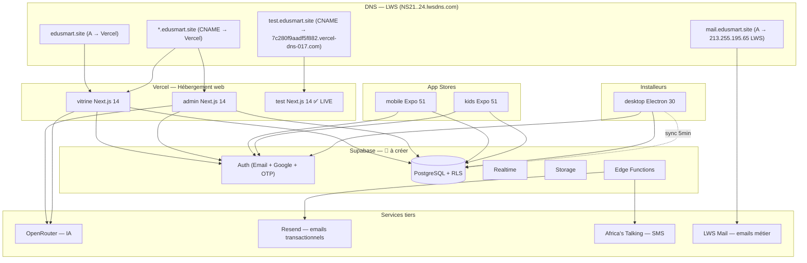
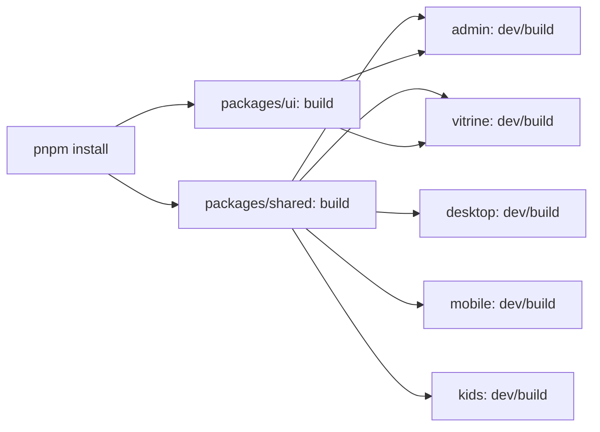
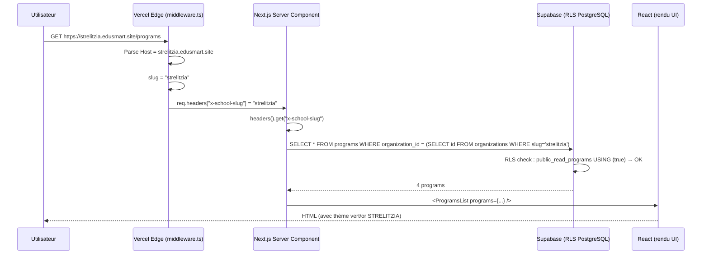
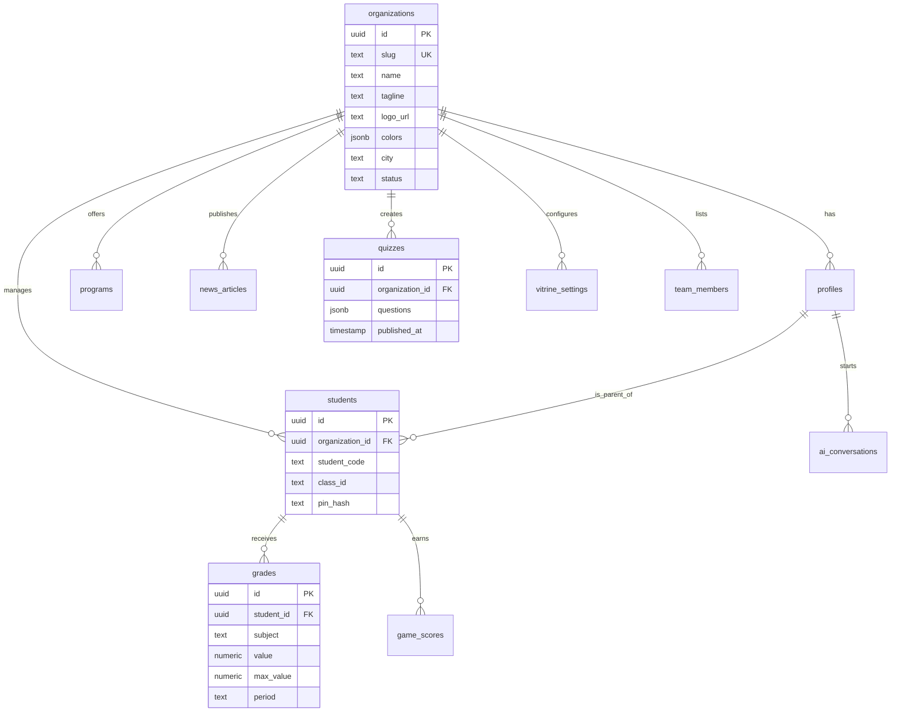
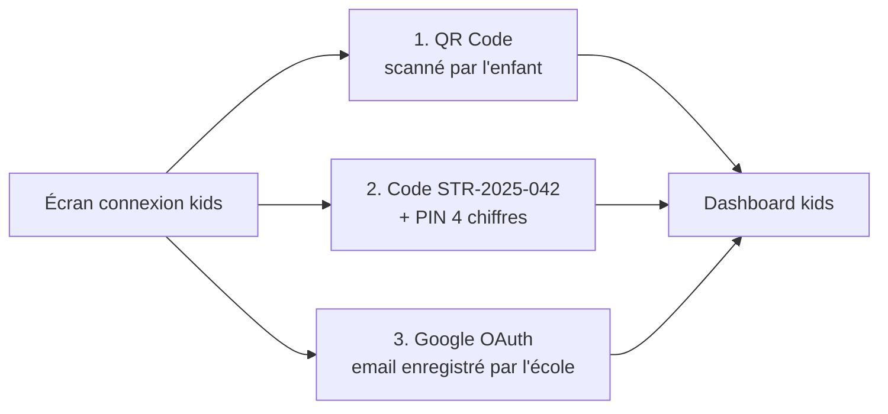
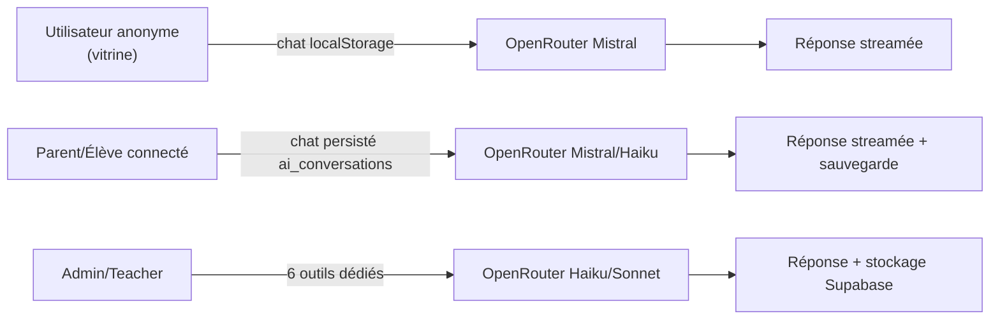
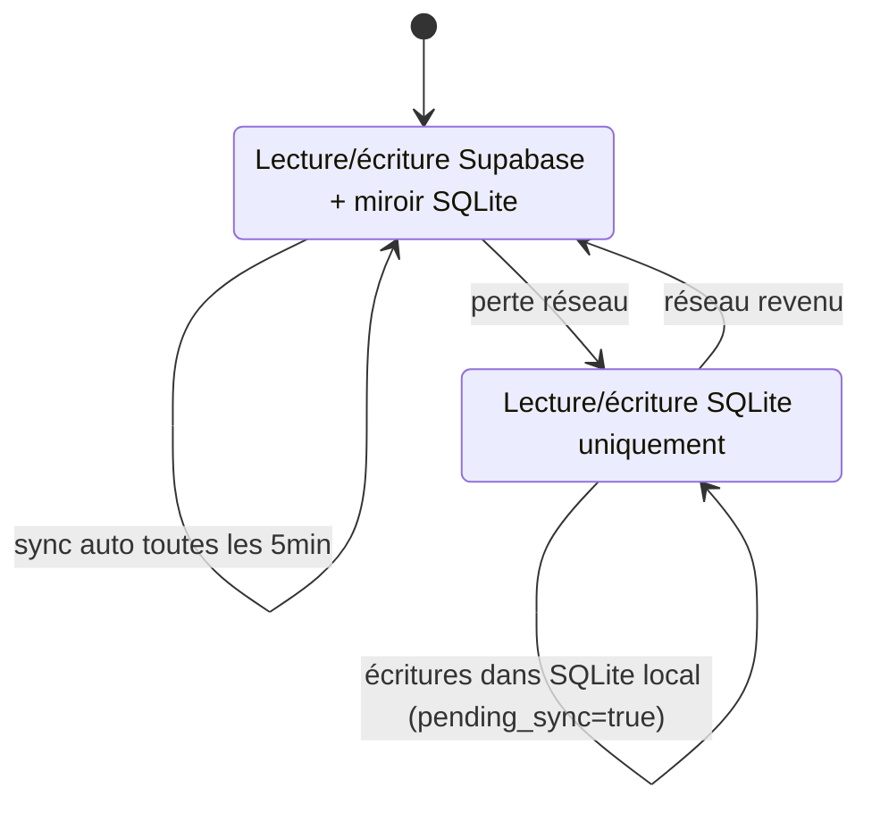
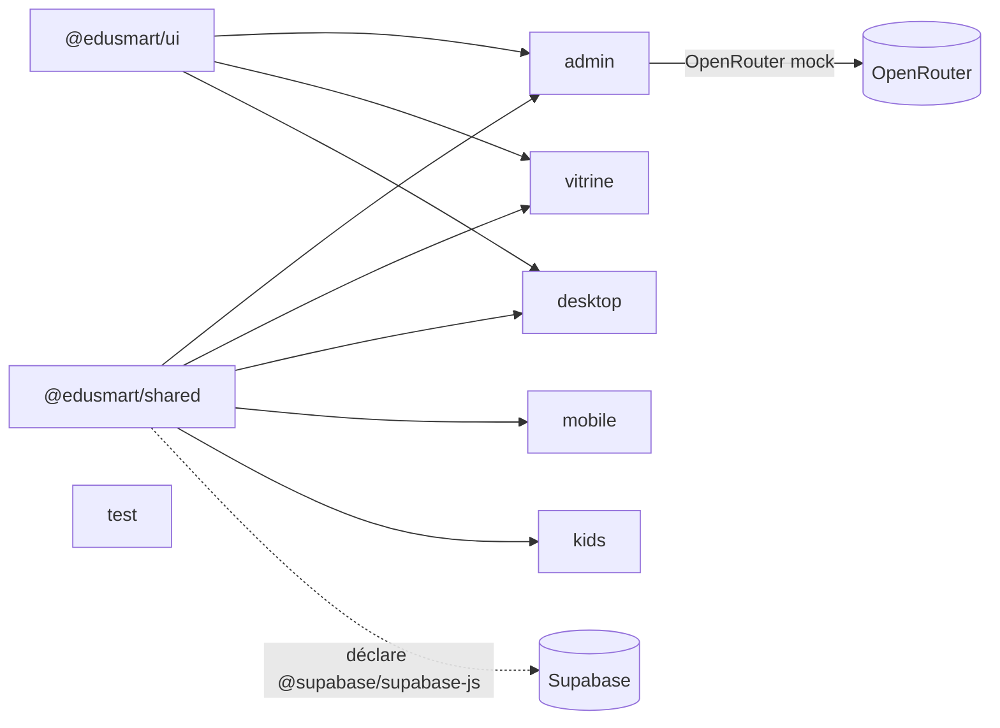

# ARCHITECTURE — EduSmart

> Architecture technique de la plateforme : monorepo, multi-tenancy par sous-domaine, flux d'authentification, isolation des données via RLS PostgreSQL, sessions par app, sync offline, intégrations IA.

---

## 1. Vue d'ensemble système



---

## 2. Monorepo Turborepo + pnpm

```
EduSmart/
├── apps/
│   ├── admin/        Next.js 14 — Portail école
│   ├── vitrine/      Next.js 14 — Site marketing + familles
│   ├── desktop/      Electron 30 + Vite + React — Secrétariat offline
│   ├── mobile/       Expo 51 — Parents/élèves
│   ├── kids/         Expo 51 — Enfants 6-14 ans
│   └── test/         Next.js 14 — Sandbox debug
├── packages/
│   ├── shared/       Types, client Supabase, utils, mocks
│   └── ui/           Design tokens (couleurs, fonts)
├── pnpm-workspace.yaml  # apps/* + packages/*
├── turbo.json           # Pipelines build/dev/lint avec cache
└── package.json         # Scripts globaux pnpm dev/build/lint
```

### Pipelines Turbo (conceptuel)



---

## 3. Multi-tenancy par sous-domaine

### Principe

> _« `organization_id` unique par école. RLS Supabase garantit l'isolation physique. »_

- **1 codebase, 1 déploiement Vercel, N écoles.**
- Le sous-domaine = la clé d'entrée tenant.

### Flux complet — d'une requête HTTP au rendu



### Résolution du slug

```ts
// Pseudo-code middleware.ts (déjà implémenté dans apps/admin et apps/vitrine)
const host = req.headers.get('host') ?? ''
const rootDomain = process.env.NEXT_PUBLIC_ROOT_DOMAIN! // edusmart.site
let slug: string

if (host.includes('localhost')) {
  slug = req.nextUrl.searchParams.get('school') ?? '__root__'
} else if (host === rootDomain || host === `www.${rootDomain}`) {
  slug = '__root__'                       // site marketing global
} else {
  slug = host.replace(`.${rootDomain}`, '') // ex: "strelitzia"
}

const headers = new Headers(req.headers)
headers.set('x-school-slug', slug)
headers.set('x-host', host)
return NextResponse.next({ request: { headers } })
```

### En local — simulateur de sous-domaines

```
http://localhost:3001                          → __root__   (vitrine globale)
http://localhost:3001?school=strelitzia        → strelitzia (vitrine école)
http://localhost:3001?school=uaz               → uaz        (vitrine école)
http://localhost:3002?school=strelitzia        → admin STRELITZIA
```

> ⚠️ **Dette actuelle** : si un slug invalide est passé, le middleware retombe silencieusement sur `strelitzia`. À durcir : whitelist d'organisations active ou 404 explicite.

---

## 4. Isolation des données — Row-Level Security

Toutes les tables sensibles ont un `organization_id UUID NOT NULL REFERENCES organizations(id)`.

### Pattern de policies (résumé)

```sql
-- Tables publiques (lecture libre pour la vitrine)
CREATE POLICY "public_read_orgs"     ON organizations  FOR SELECT USING (true);
CREATE POLICY "public_read_programs" ON programs       FOR SELECT USING (true);
CREATE POLICY "public_read_news"     ON news_articles  FOR SELECT USING (published = true);

-- Tables privées (isolation stricte par école via JWT custom claim)
CREATE FUNCTION current_user_organization_id() RETURNS uuid AS $$
  SELECT (auth.jwt() ->> 'organization_id')::uuid
$$ LANGUAGE sql STABLE;

CREATE POLICY "school_isolation" ON students
  FOR ALL USING (organization_id = current_user_organization_id());

CREATE POLICY "school_isolation" ON grades
  FOR ALL USING (organization_id = current_user_organization_id());

-- Profil utilisateur — strict ownership
CREATE POLICY "own_profile" ON profiles
  FOR ALL USING (id = auth.uid());
```

### Schéma — entités principales (à instancier)



> Détail SQL complet dans [DATABASE_SCHEMA](../04-database/DATABASE_SCHEMA.md) _(à générer Phase 2)_.

---

## 5. Authentification — flux par rôle

### 5.1 Login → redirection par rôle

```ts
const redirectMap = {
  super_admin: '/admin/super',
  director:    '/admin/dashboard',
  teacher:     '/admin/grades',
  secretary:   '/admin/students',
  parent:      '/dashboard',
  student:     '/dashboard/student',
}
// + vérification d'intégrité : profile.organization_id === slug.organization_id
//   sinon → 403 (tentative cross-tenant)
```

### 5.2 Sessions — stratégie par app

| App | Stockage | Durée |
|---|---|---|
| **Web Next.js** (admin, vitrine) | Cookie `httpOnly` Supabase | 1h + refresh auto |
| **Mobile** (Expo) | iOS Keychain / Android Keystore | Jusqu'à déconnexion explicite |
| **Kids** (Expo) | MMKV chiffré | Toute l'année scolaire |
| **Desktop** (Electron) | `electron-store` chiffré | Permanent (avec PIN local) |

### 5.3 App `kids` — 3 modes de connexion



> Le payload du QR : `{ student_code, organization_id, expires_at }` signé, valable 24h.

### 5.4 Google OAuth — 1 seul credential pour toutes les écoles

> Décision (Export V3, msg 61) : éviter la multiplication des apps Google Console.

```
edusmart.site/auth/callback?school=strelitzia
    ↓ Google redirige ici après login
    ↓ Le callback lit ?school=strelitzia
    ↓ Redirige vers strelitzia.edusmart.site/auth/finalize
    ↓ Crée la session Supabase avec organization_id correct
```

---

## 6. Architecture IA (OpenRouter)

### Modèles utilisés selon le besoin

| Besoin | Modèle | Pourquoi |
|---|---|---|
| Chat anonyme (vitrine) | `mistralai/mistral-7b-instruct` | Pas cher, suffit pour FAQ |
| Génération de leçons | `anthropic/claude-3-haiku` | Bon style pédagogique, rapide |
| Génération de quiz | `mistralai/mistral-7b-instruct` + `response_format: json_object` | JSON strict, économique |
| Appréciations bulletins (×3 variantes) | `anthropic/claude-3-haiku` | Naturel, varié |
| Analyse de classe (rapports) | `anthropic/claude-3-5-sonnet` | Raisonnement plus profond |
| Communications parents | `mistralai/mistral-7b-instruct` | Texte court, économique |
| Détection décrochage (cron hebdo) | `anthropic/claude-3-haiku` | Pattern matching simple |

### 3 niveaux d'usage



> Détail des prompts et garde-fous : [API_REFERENCE](../05-api/API_REFERENCE.md) _(à générer Phase 2)_.

---

## 7. Sync offline desktop (Electron)

### Principe



### Schéma de synchro

- **Tables miroir Supabase** dans SQLite (students, grades, payments…).
- Chaque ligne porte `updated_at` (UTC) + `pending_sync BOOLEAN`.
- **Stratégie conflit** : `last-write-wins` sur `updated_at`.
- **Sync push** : SELECT `WHERE pending_sync = true` → POST Supabase → UPDATE local `pending_sync = false`.
- **Sync pull** : SELECT Supabase `WHERE updated_at > local_max_updated_at` → INSERT/UPDATE local.

### IPC Electron prévu

| Channel | Direction | Usage |
|---|---|---|
| `auth:login` | renderer → main | Login secrétaire |
| `db:students:list` | renderer → main | Lit SQLite local |
| `db:grades:save` | renderer → main | Écrit SQLite + flag pending |
| `sync:tick` | main → renderer | Notif "sync en cours" |
| `print:bulletin` | renderer → main | Génère PDF + dialog impression |

> 🔴 **Aucun de ces channels n'est encore implémenté.**

---

## 8. Theming dynamique multi-tenant

```ts
// Vitrine et admin : injection de CSS custom properties au layout
<html style={{
  '--color-primary':   org.colors.primary,    // #1A4D3A (Strelitzia)
  '--color-secondary': org.colors.secondary,  // #C9A84C
  '--color-surface':   org.colors.surface,    // #FAFAF8
} as React.CSSProperties}>
```

Tailwind utilise ces variables via `tailwind.config.ts` :
```js
colors: {
  primary: 'var(--color-primary)',
  secondary: 'var(--color-secondary)',
  surface: 'var(--color-surface)',
}
```

Conséquence : changer la couleur d'une école = 1 UPDATE en base, 0 rebuild.

---

## 9. CI/CD (état actuel)

```
GitHub push main/develop
   ↓
.github/workflows/ci.yml
   ↓
- Setup Node 20 + pnpm 9
- pnpm install --frozen-lockfile
- type-check @edusmart/test
- build @edusmart/test
```

**Manquant** :
- Lint global monorepo (`pnpm lint`).
- Type-check et build pour `admin`, `vitrine`, `desktop`.
- Tests unitaires (vitest), tests E2E (Playwright).
- Deploy Vercel automatique (actuellement déclenché par Git push direct, mais sans gate).

---

## 10. Domaines & routing global

| URL | App ciblée | Contenu |
|---|---|---|
| `https://edusmart.site` | `vitrine` (slug `__root__`) | Marketing B2B (directeurs prospects) |
| `https://strelitzia.edusmart.site` | `vitrine` (slug `strelitzia`) | Vitrine école STRELITZIA pour familles |
| `https://strelitzia.edusmart.site/admin` | `admin` (slug `strelitzia`) | Portail interne STRELITZIA |
| `https://test.edusmart.site` | `test` | Sandbox interne |
| `mailto:contact@edusmart.site` | `mail.edusmart.site` (LWS) | Boîte mail métier |

> Voir [`2026-05-25___backup_zone_edusmart.site.txt`](../../2026-05-25___backup_zone_edusmart.site.txt) pour la config DNS LWS exacte.

---

## 11. Diagramme des dépendances internes



---

## 12. Décisions architecturales (résumé — détail Phase 2)

| # | Décision | Alternative écartée | Raison |
|---|---|---|---|
| ADR-001 | Monorepo Turborepo + pnpm | Multi-repos | Code partagé `packages/shared`, cache build |
| ADR-002 | Next.js 14 App Router pour web | Pages Router / SPA Vite | Server Components + middleware natif multi-tenant |
| ADR-003 | Supabase tout-en-un | Backend custom Node + Postgres | Auth + RLS + Realtime + Storage en 1 outil, gratuit pour démarrer |
| ADR-004 | Multi-tenancy par sous-domaine | Path-based (`/strelitzia/...`) | URL plus pro, SEO meilleur, cookies isolés par sous-domaine |
| ADR-005 | OpenRouter pour l'IA | OpenAI direct | Multi-modèles, fallback, coûts plus bas |
| ADR-006 | Expo SDK 51 mobile | React Native CLI | Builds EAS cloud, OTA updates |
| ADR-007 | Electron pour desktop | PWA installable | Offline robuste + impression native + stockage SQLite |
| ADR-008 | 1 seul credential Google OAuth | 1 par école | Évite la multiplication des apps Google Console |
| ADR-009 | Hébergement Vercel | Netlify / Cloudflare Pages | Wildcard `*.edusmart.site` natif, preview deploys |
| ADR-010 | DNS LWS conservé (NS21..24) | NS Vercel | Permet de garder LWS Mail + pointer le web vers Vercel |

---

## 13. Liens

- 📊 [CURRENT_STATE](../01-overview/CURRENT_STATE.md) — Qu'est-ce qui est réellement codé
- ▶️ [NEXT_ACTIONS](../10-roadmap/NEXT_ACTIONS.md) — Prochaines étapes
- 🗂️ [MASTER_INDEX](../MASTER_INDEX.md) — Tous les docs

---

_Sources : analyse des exports IA + code source réel (middlewares, package.json, configs) + décisions documentées dans EduSmart_VibeCoding_Guide.md._
