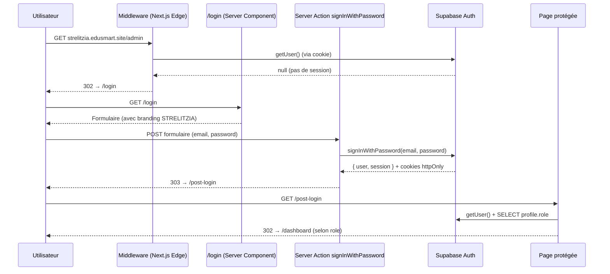
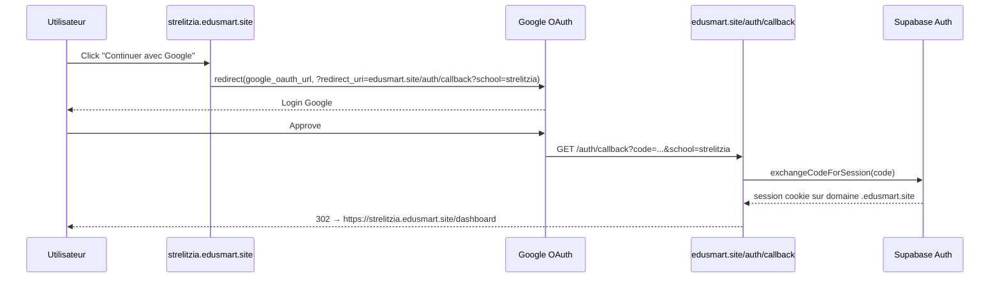
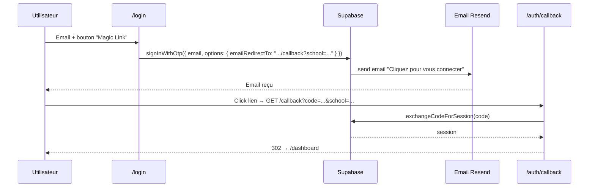
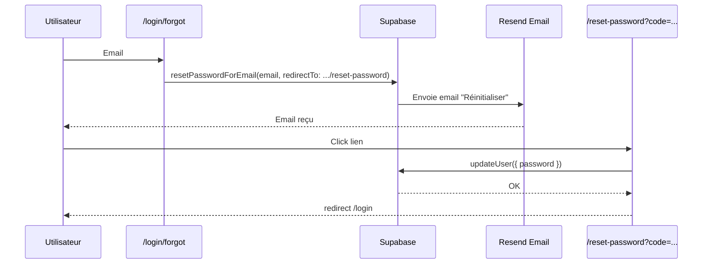

# AUTH FLOW — EduSmart

> Flux d'authentification pour les 6 applications, basé sur Supabase Auth.
> **6 rôles** (super_admin, director, teacher, secretary, parent, student) × **3 surfaces** (web, mobile, desktop) × **multi-tenant** par sous-domaine.

---

## 1. Méthodes d'authentification supportées

| Méthode | Surfaces | Usage typique |
|---|---|---|
| **Email + password** | Web admin, mobile | Directeurs, profs, secrétaires, parents |
| **Magic Link (OTP)** | Web admin, mobile | Premier login, mot de passe perdu |
| **Google OAuth** | Web admin, mobile, kids | Parents et enseignants (déjà compte Google) |
| **Code court + PIN** | Kids (Expo) | Enfants 6-14 ans sans email |
| **QR Code** | Kids (Expo) | Enfants scolarisés (scan par tablette école) |
| **PIN local desktop** | Desktop | Reconnexion rapide secrétariat |

---

## 2. Flux web complet (admin) — email/password



---

## 3. Flux Google OAuth multi-tenant

> **Décision critique** : 1 seul credential Google pour TOUTES les écoles ([ADR-008](../13-decisions/ADR-008-google-oauth-unique.md)).



Le cookie de session est posé sur le domaine **`.edusmart.site`** (avec point initial) → partagé entre tous les sous-domaines.

---

## 4. Flux Magic Link



---

## 5. Flux kids (3 modes)

### 5.1 QR Code (recommandé)

```
1. Enseignant ouvre /admin/kids/qr-generator
2. Sélectionne classe → génère 1 QR par élève
3. QR payload = JWT signé { student_code, organization_id, expires_at (24h) }
4. Élève scanne avec app kids → POST /api/kids/qr-login { token }
5. Backend valide JWT → crée session Supabase → retourne tokens
6. App kids stocke en MMKV chiffré
```

### 5.2 Code court + PIN

```
1. Écran kids : "Mon code STR-2025-042" + "Mon PIN ****"
2. POST /api/kids/code-login { student_code, organization_slug, pin }
3. Backend : SELECT students WHERE organization_id = (slug) AND student_code = ... AND pin_hash = bcrypt(pin)
4. Si match → crée session Supabase Auth (user shadow)
5. Stocke en MMKV
```

### 5.3 Google OAuth (parents)

Identique au flux web, mais via `expo-auth-session`.

---

## 6. Sessions — stockage par app

| App | Storage | Durée | Refresh |
|---|---|---|---|
| **Web (admin, vitrine)** | Cookie httpOnly `sb-<project>-auth-token` | 1h (refresh auto via middleware) | Auto via `updateSupabaseSession` |
| **Mobile** | iOS Keychain / Android Keystore (`expo-secure-store`) | Jusqu'à logout explicite | Auto via SDK Supabase |
| **Kids** | MMKV chiffré (`react-native-mmkv`) | Toute l'année scolaire | Auto |
| **Desktop** | `electron-store` chiffré + PIN local | Permanent | Auto |

---

## 7. Anti cross-tenant — vérification systématique

Après chaque login, et à chaque requête protégée :

```ts
// Dans getAdminTenant() ou middleware équivalent
const profile = await getCurrentProfile()  // SELECT FROM profiles WHERE id = auth.uid()
const tenant = await getOrganizationBySlug(slug)

if (profile.role !== 'super_admin' && profile.organization_id !== tenant.id) {
  redirect('/forbidden')  // ou 403
}
```

**Sans cette vérification** : un user STRELITZIA connecté pourrait charger `uaz.edusmart.site/admin` et accéder à l'UI UAZ (les données restant filtrées par RLS, mais l'UI parlerait d'UAZ avec le nom du user STRELITZIA → fuite UX).

---

## 8. Redirection par rôle (post-login)

```ts
const REDIRECT_BY_ROLE: Record<string, string> = {
  super_admin: '/admin/super',
  director:    '/admin',
  teacher:     '/admin/grades',
  secretary:   '/admin/students',
  parent:      '/dashboard',
  student:     '/dashboard/student',
}
```

L'utilisateur peut accéder à d'autres routes (sauf restrictions explicites), mais sa **page d'accueil par défaut** est adaptée.

---

## 9. Gestion des rôles & permissions

| Action | super_admin | director | teacher | secretary | parent | student |
|---|:-:|:-:|:-:|:-:|:-:|:-:|
| Voir toutes les écoles | ✅ | ❌ | ❌ | ❌ | ❌ | ❌ |
| Voir sa propre école | ✅ | ✅ | ✅ | ✅ | ❌ | ❌ |
| Créer/modifier élèves | ✅ | ✅ | ❌ | ✅ | ❌ | ❌ |
| Saisir notes | ✅ | ✅ | ✅ | ❌ | ❌ | ❌ |
| Modifier vitrine | ✅ | ✅ | ❌ | ❌ | ❌ | ❌ |
| Approuver `school_requests` | ✅ | ❌ | ❌ | ❌ | ❌ | ❌ |
| Voir notes de ses enfants | ❌ | ❌ | ❌ | ❌ | ✅ | ❌ |
| Voir ses propres notes | ❌ | ❌ | ❌ | ❌ | ❌ | ✅ |
| Outils IA (génération leçon) | ✅ | ✅ | ✅ | ❌ | ❌ | ❌ |
| Chat IA | ✅ | ✅ | ✅ | ✅ | ✅ | ✅ |

Helper côté code :
```ts
import { requireRole } from '@/lib/auth-helpers'

export default async function GradesPage() {
  await requireRole(['director', 'teacher', 'super_admin'])
  // ...
}
```

---

## 10. Sécurité — checklist

- [ ] `SUPABASE_SERVICE_ROLE_KEY` jamais exposée client.
- [ ] Cookies session `httpOnly`, `secure`, `sameSite=lax`.
- [ ] Magic Link expire en 1h.
- [ ] PIN kids hashé bcrypt (cost ≥ 10).
- [ ] Tentatives de login échouées rate-limitées (Supabase native + reverse proxy Vercel).
- [ ] CSRF protection : Server Actions Next.js incluent un token automatique.
- [ ] Audit log : table `auth_events` (login/logout/role_change) — P3.
- [ ] 2FA TOTP pour `super_admin` et `director` — P3.

---

## 11. Forgot password



---

## 12. Logout

```ts
// Server Action
export async function signOut() {
  const supabase = createSupabaseServerClient()
  await supabase.auth.signOut()
  redirect('/login')
}
```

Côté mobile : `await supabase.auth.signOut()` + clear MMKV/SecureStore.

---

## 13. Liens

- 📌 [tasks/STEP_04](../../tasks/STEP_04.md) — Implémenter l'auth réelle
- 🛡️ [SECURITY_REPORT](../14-security/SECURITY_REPORT.md)
- 🏗️ [ARCHITECTURE](../02-architecture/ARCHITECTURE.md#5-authentification--flux-par-rôle)
- 🗄️ [DATABASE_SCHEMA](../04-database/DATABASE_SCHEMA.md#22-profiles--étend-authusers)
