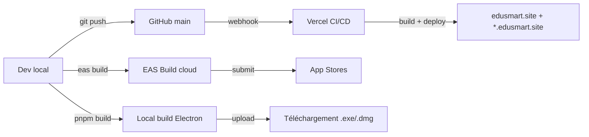

# DEPLOYMENT — EduSmart

> Mise en production des 6 applications : Vercel (web), EAS (mobile), electron-builder (desktop), Supabase (backend), LWS (DNS).

---

## 1. Vue d'ensemble



---

## 2. Web (vitrine, admin, test) — Vercel

### 2.1 Setup initial

```
1. Dashboard Vercel → Add New Project
2. Import GitHub repo dieudonne261/EduSmart
3. Root Directory : laisser vide (monorepo détecté)
4. Framework Preset : Next.js
5. Build Command : pnpm turbo run build --filter=@edusmart/<app>
6. Output Directory : apps/<app>/.next
7. Install Command : pnpm install --frozen-lockfile
8. Environment Variables : voir ENV_VARIABLES.md
```

Créer **3 projets Vercel** distincts (un par app web) :
- `edusmart-vitrine` → `--filter=@edusmart/vitrine`
- `edusmart-admin` → `--filter=@edusmart/admin`
- `edusmart-test` → `--filter=@edusmart/test` (déjà fait ✅)

### 2.2 Domaines

| Projet Vercel | Domaine(s) |
|---|---|
| `edusmart-vitrine` | `edusmart.site`, `www.edusmart.site`, `*.edusmart.site` |
| `edusmart-admin` | Sous-routes `/admin/*` proxy depuis vitrine, OU sous-domaine `admin.edusmart.site` |
| `edusmart-test` | `test.edusmart.site` ✅ |

> **Architecture recommandée** : 1 seul projet Vercel pour vitrine+admin (App Router supporte les deux). À étudier si on garde 2 projets séparés.

### 2.3 Wildcard `*.edusmart.site`

Dashboard Vercel → Project Settings → Domains → Add `*.edusmart.site`.
Vercel donne une instruction CNAME à coller dans LWS Zone DNS :

```
*    CNAME    7c280f9aadf5f882.vercel-dns-017.com.
```

> ⚠️ Le wildcard intercepte tous les sous-domaines y compris `mail`. Garder un `A mail` explicite pour la boîte LWS (voir [DECISIONS ADR-010](../13-decisions/ADR-010-dns-lws.md)).

### 2.4 Branches → environnements

| Branche | Environnement | URL |
|---|---|---|
| `main` | Production | edusmart.site |
| `develop` | Preview (auto) | `<projet>-git-develop.vercel.app` |
| `feature/*` | Preview (auto) | `<projet>-git-feature-xxx.vercel.app` |

### 2.5 Variables d'env Vercel

Production + Preview + Development séparément :
- `NEXT_PUBLIC_SUPABASE_URL`
- `NEXT_PUBLIC_SUPABASE_ANON_KEY`
- `SUPABASE_SERVICE_ROLE_KEY` (Production + Preview uniquement, **pas Development local**)
- `OPENROUTER_API_KEY`
- `RESEND_API_KEY` (Production uniquement — évite spam preview)
- `NEXT_PUBLIC_ROOT_DOMAIN=edusmart.site` (Production)
- `NEXT_PUBLIC_ROOT_DOMAIN=$VERCEL_URL` (Preview — adapter middleware)

---

## 3. Mobile (apps/mobile, apps/kids) — EAS Build

### 3.1 Setup EAS

```bash
cd apps/mobile
npx expo install expo-dev-client
npx eas-cli login
npx eas build:configure
# → crée eas.json
```

### 3.2 `eas.json` (par app)

```json
{
  "cli": { "version": ">= 5.0.0" },
  "build": {
    "development": { "developmentClient": true, "distribution": "internal" },
    "preview":     { "distribution": "internal", "channel": "preview" },
    "production":  { "channel": "production" }
  },
  "submit": {
    "production": {
      "android": { "track": "internal" },
      "ios":     { "appleId": "...", "ascAppId": "..." }
    }
  }
}
```

### 3.3 Build & soumission

```bash
# iOS (cloud)
npx eas build --platform ios --profile production

# Android (cloud)
npx eas build --platform android --profile production

# Soumission stores
npx eas submit --platform ios --latest
npx eas submit --platform android --latest

# OTA update (sans rebuild)
npx eas update --branch production --message "Fix login bug"
```

### 3.4 Stores

- **Apple Developer Program** : 99 €/an. Soumission via App Store Connect.
- **Google Play** : 25 € one-time. Soumission via Play Console.

Compter ~5-7 jours pour la première review iOS, ~24h pour Android.

---

## 4. Desktop (apps/desktop) — electron-builder

### 4.1 Build local

```bash
pnpm --filter @edusmart/desktop build
# Output : apps/desktop/release/EduSmart-Setup-1.0.0.exe (Windows)
#          apps/desktop/release/EduSmart-1.0.0.dmg (macOS)
#          apps/desktop/release/EduSmart-1.0.0.AppImage (Linux)
```

### 4.2 Configuration `electron-builder` (extrait `apps/desktop/package.json`)

```json
{
  "build": {
    "appId": "site.edusmart.desktop",
    "productName": "EduSmart Desktop",
    "directories": { "output": "release" },
    "files": ["dist/**/*", "electron/**/*"],
    "win":   { "target": "nsis", "signAndEditExecutable": false },
    "mac":   { "target": ["dmg", "zip"] },
    "linux": { "target": ["AppImage", "deb"] }
  }
}
```

### 4.3 Distribution

| Plateforme | Mode | Coût |
|---|---|---|
| Windows | NSIS installer + GitHub Releases (gratuit) | 0 € |
| macOS | DMG signé (Apple Developer ID required pour notarisation) | 99 €/an |
| Linux | AppImage / .deb sur GitHub Releases | 0 € |

### 4.4 Auto-update (P3)

Avec `electron-updater` + GitHub Releases :
```ts
import { autoUpdater } from 'electron-updater'
autoUpdater.checkForUpdatesAndNotify()
```

---

## 5. Backend (Supabase) — déjà cloud-hosted

| Tâche | Procédure |
|---|---|
| Déployer une migration | `npx supabase db push` |
| Déployer une Edge Function | `npx supabase functions deploy on_school_approved` |
| Backup DB | Dashboard → Database → Backups (Pro plan : daily auto) |
| Restore DB | Dashboard → Backups → Restore |
| Logs | Dashboard → Logs → Postgres/Auth/Edge/Realtime |
| Monitoring quotas | Dashboard → Reports → Usage |

### Plan pricing

| Plan | DB | Bandwidth | MAU | Backups | Coût |
|---|---|---|---|---|---|
| Free | 500 MB | 5 GB | 50k | manuel | 0 $/mois |
| Pro | 8 GB | 250 GB | 100k | daily 7j | 25 $/mois |
| Team | 8 GB+ | 250 GB+ | unlimited | daily 14j | 599 $/mois |

> **Recommandation** : démarrer Free, passer Pro dès que la 1ère école dépasse 100 utilisateurs actifs.

---

## 6. DNS LWS — configuration actuelle

Voir le backup `2026-05-25___backup_zone_edusmart.site.txt`. Résumé :

| Type | Nom | Valeur | TTL |
|---|---|---|---|
| A | @ | `<IP Vercel>` | 3600 |
| A | mail | `213.255.195.65` (LWS) | 3600 |
| CNAME | * | `7c280f9aadf5f882.vercel-dns-017.com.` | 3600 |
| CNAME | test | `7c280f9aadf5f882.vercel-dns-017.com.` | 3600 |
| MX | @ | `mail.edusmart.site.` priority 10 | 3600 |
| TXT | _vercel | `<token vérif>` | 3600 |
| TXT | @ | `v=spf1 include:_spf.mail.lws.fr include:_spf.resend.com -all` | 3600 |
| TXT | resend._domainkey | `<DKIM resend>` | 3600 |
| TXT | _dmarc | `v=DMARC1; p=quarantine; rua=mailto:contact@edusmart.site` | 3600 |

---

## 7. Pré-flight checklist (avant chaque release prod)

- [ ] `pnpm -r type-check` passe sur toutes les apps
- [ ] `pnpm -r build` passe (en local pour valider)
- [ ] `.env.example` à jour (aucune nouvelle var oubliée)
- [ ] Vercel env vars à jour
- [ ] Aucun secret nouvellement exposé (`git grep eyJ`)
- [ ] CHANGELOG mis à jour
- [ ] Tests E2E passent (P3)
- [ ] Sentry releases configuré (P3)
- [ ] Backup Supabase fait
- [ ] PR mergée dans `main` avec review

---

## 8. Rollback

### Vercel
Dashboard → Deployments → ancien déploiement → "Promote to Production".
Rollback en < 30 secondes.

### Supabase
SQL Editor : exécuter la migration inverse (à préparer).
Ou Backup restore (Pro plan).

### Mobile
EAS Update : `eas update --branch production --republish <oldUpdateId>`.

### Desktop
Renvoyer aux users l'ancien installeur sur GitHub Releases.

---

## 9. Monitoring (P3)

| Service | Usage | Coût |
|---|---|---|
| Vercel Analytics | Vitals, pages | gratuit (limité) |
| Plausible | Pages vues, conversions (privacy-first) | 9 $/mois |
| Sentry | Erreurs frontend/backend | gratuit jusqu'à 5k events/mois |
| BetterStack | Uptime monitoring | gratuit jusqu'à 10 monitors |
| Supabase Logs | Postgres queries, Auth events | inclus |

---

## 10. Liens

- ⚙️ [SETUP_GUIDE](../03-setup/SETUP_GUIDE.md)
- 🔐 [ENV_VARIABLES](../03-setup/ENV_VARIABLES.md)
- 📌 [tasks/STEP_15](../../tasks/STEP_15.md) — Déploiement production multi-école
