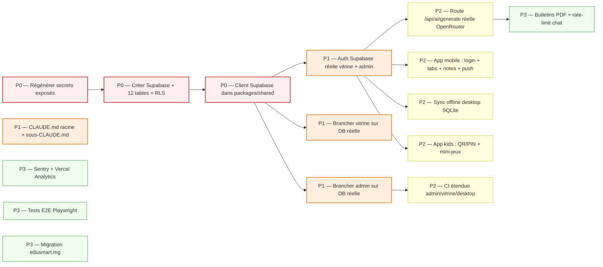

# NEXT ACTIONS — EduSmart

> Actions prioritaires pour passer du **squelette monorepo** à une **plateforme déployable**.
> Priorisation **P0** (critique, bloque le reste) → **P3** (polish, optionnel).
> Chaque action P0/P1 a une étape exécutable détaillée dans [/tasks](../../tasks/).

---

## 🚦 Vue d'ensemble — où sont les blockers

---

## 🔴 P0 — Critique (à faire en premier, débloque tout le reste)

### P0-1 — Régénérer les secrets exposés dans `.env.example`

**Pourquoi** : `.env.example` contient des clés réelles (JWT Supabase, OpenRouter, Resend, Twilio). Si le repo passe en public, ces clés sont compromises.

**Quoi faire** :
1. Lister les secrets exposés (audit du diff `.env.example`).
2. Régénérer dans chaque dashboard (Supabase, OpenRouter, Resend, Twilio).
3. Remplacer dans `.env.example` par des placeholders (`<your-supabase-anon-key>`).
4. Mettre les vraies valeurs uniquement dans `.env` (gitignored) + Vercel env vars.
5. Vérifier `.gitignore` couvre `.env`, `.env.local`, `.env.*.local`.

**Bloque** : Toute mise en production sûre.

📄 Détail : [tasks/STEP_02.md](../../tasks/STEP_02.md)

---

### P0-2 — Créer le projet Supabase + 12 tables + RLS

**Pourquoi** : Sans DB, rien n'est persistant. C'est le socle de tout le projet.

**Quoi faire** :
1. Créer un projet Supabase (région **Singapore**, recommandée par le guide).
2. Récupérer `SUPABASE_URL`, `SUPABASE_ANON_KEY`, `SUPABASE_SERVICE_ROLE_KEY`.
3. Exécuter le script SQL complet (organizations, school_requests, profiles, programs, news_articles, students, grades, quizzes, game_scores, ai_conversations, vitrine_settings, team_members).
4. Activer RLS sur toutes les tables sensibles + créer les policies.
5. Insérer données test : STRELITZIA + UAZ + ~10 élèves + ~20 notes.
6. Configurer Supabase Auth :
   - Site URL : `https://edusmart.site`
   - Redirect URLs : `https://*.edusmart.site/**` + `http://localhost:3001/**` + `http://localhost:3002/**`
   - SMTP Resend : `smtp.resend.com:465`
   - Personnaliser les 5 templates emails (confirm, magic_link, reset, change, welcome)

**Bloque** : Toute persistance, toute auth réelle, toute démo crédible.

📄 Détail : [tasks/STEP_01.md](../../tasks/STEP_01.md)

---

### P0-3 — Implémenter le client Supabase dans `packages/shared`

**Pourquoi** : `@supabase/supabase-js@2.43` est déclaré mais aucun client n'est instancié. Le dossier `packages/shared/src/supabase/` est vide.

**Quoi faire** :
1. `packages/shared/src/supabase/client.ts` → client browser (anon key).
2. `packages/shared/src/supabase/server.ts` → client server (service role) pour Server Components.
3. `packages/shared/src/supabase/types.ts` → types générés via `supabase gen types typescript`.
4. Adapter les getters existants de `mock-data.ts` pour qu'ils prennent un client Supabase en argument (ou faire des versions `*Async` qui interrogent la DB réelle).
5. Garder `mock-data.ts` actif pour les tests et le dev hors-ligne.

**Bloque** : Tous les fetches DB depuis admin, vitrine, mobile, kids, desktop.

📄 Détail : [tasks/STEP_03.md](../../tasks/STEP_03.md)

---

## 🟠 P1 — Important (à faire juste après P0)

### P1-1 — Auth Supabase réelle (remplacer login mock)

**Pourquoi** : Login admin actuel = `directeur@strelitzia.test` / `Test1234!` codé en dur. Aucune sécurité.

**Quoi faire** :
1. Créer route `/auth/callback` (obligatoire pour OAuth + Magic Link).
2. Remplacer `apps/admin/src/app/login/page.tsx` par un formulaire Supabase (email + password ou Magic Link).
3. Créer middleware d'auth qui redirige `/admin/*` vers `/admin/login` si pas de session.
4. Implémenter `redirectMap` par rôle (director→/admin/dashboard, teacher→/admin/grades, etc.).
5. Vérifier `profile.organization_id === slug.organization_id` (anti cross-tenant).

**Bloque** : Toute sécurité réelle, toute mise en prod.

📄 Détail : [tasks/STEP_04.md](../../tasks/STEP_04.md)

---

### P1-2 — Brancher la vitrine sur Supabase (programs, news, organizations)

**Pourquoi** : La vitrine sert de démo. Elle doit lire de vraies données.

**Quoi faire** :
1. Remplacer `getOrganizationBySlug(slug)` (mock) par un fetch Supabase équivalent dans `getTenantContext()`.
2. Remplacer `getProgramsByOrganizationId(id)` et `getNewsByOrganizationId(id)`.
3. Garder les fonctions mock pour les tests, mais router les pages vers les versions DB.
4. Activer ISR (`revalidate: 60`) pour les pages publiques.
5. Tester : `strelitzia.edusmart.site` affiche les vrais programs/news, `uaz.edusmart.site` les siens.

**Bloque** : Démo crédible, ajout dynamique d'une école sans rebuild.

📄 Détail : [tasks/STEP_05.md](../../tasks/STEP_05.md)

---

### P1-3 — Brancher l'admin sur Supabase (students, grades)

**Pourquoi** : Idem vitrine mais côté admin (saisie réelle).

**Quoi faire** :
1. Page `/admin/students` : remplacer mock par `SELECT students WHERE organization_id = ?`.
2. Page `/admin/grades` : implémenter saisie + liste avec calcul moyenne (`gradeCalc.ts` est déjà prêt).
3. Server Actions pour create/update/delete (avec RLS qui sécurise).
4. Optimistic UI avec `useTransition`.
5. Tester avec 2 sessions (directeur STRELITZIA vs directeur UAZ) → vérifier isolation.

**Bloque** : Phase 4 (IA admin), démo bulletins.

---

### P1-4 — `CLAUDE.md` racine + sous-CLAUDE.md par app

**Pourquoi** : Discipline pour les futures sessions Claude Code (le guide VibeCoding insiste : "Une session = une tâche = un commit").

**Quoi faire** :
1. `CLAUDE.md` racine : règles d'or (TS strict, filtrer par `organization_id`, jamais de secret en dur, etc.) + commandes utiles + structure monorepo.
2. `apps/admin/CLAUDE.md` : routes, conventions, IA tools.
3. `apps/vitrine/CLAUDE.md` : multi-tenant, ISR, contact form.
4. `apps/desktop/CLAUDE.md` : IPC, SQLite, sync, build Electron.
5. `packages/shared/CLAUDE.md` : règles d'export, conventions types.

**Bloque** : Qualité et cohérence des futures contributions IA.

---

## 🟡 P2 — Amélioration (Phase post-fondations)

### P2-1 — Route `/api/ai/generate` réelle via OpenRouter

- Remplacer le mock dans `apps/admin/src/app/api/ai/generate/route.ts`.
- Streaming SSE.
- Switch de modèle selon `task` (`lesson` → Haiku, `quiz` → Mistral JSON, `analysis` → Sonnet).
- Persister la conversation dans `ai_conversations`.

### P2-2 — App mobile (Expo)

- Login Supabase (email/password + Magic Link).
- Tabs : Notes, Devoirs, Messages, Profil.
- Écran notes avec graphiques (`victory-native` ou `react-native-chart-kit`).
- Notifications push via Supabase Realtime + Expo Notifications.

### P2-3 — Sync offline desktop SQLite

- Schéma SQLite miroir des tables Supabase critiques (students, grades, payments).
- IPC channels (`auth:login`, `db:students:list`, `db:grades:save`, `sync:tick`, `print:bulletin`).
- Worker de sync 5 min.
- UI "pending sync" + indicateur réseau.

### P2-4 — App kids (Expo)

- Login QR Code (scan via caméra), code court + PIN, Google OAuth.
- 4-5 mini-jeux (QCM rapide, drag-drop, mémorisation, calcul).
- Sync des quiz publiés par admin → cache local MMKV.
- Persistance `game_scores` Supabase.

### P2-5 — CI étendue

- Type-check + build pour admin, vitrine, desktop, mobile (en plus de test).
- Lint monorepo : `pnpm lint`.
- Job séparé `test-unit` (vitest) et `test-e2e` (Playwright headless).

---

## 🟢 P3 — Polish / nice-to-have

| ID | Action | Note |
|---|---|---|
| P3-1 | Génération bulletins PDF | `@react-pdf/renderer` ou `puppeteer-core` côté server |
| P3-2 | Rate-limit `/api/chat` | Map en mémoire (10 msg/IP/h) ou Upstash Redis |
| P3-3 | Sentry + Vercel Analytics | Monitoring erreurs + perf |
| P3-4 | Tests E2E Playwright | Scénarios login, multi-tenant, saisie note |
| P3-5 | Migration `edusmart.site` → `edusmart.mg` | Quand le déploiement réel commence |
| P3-6 | Détection décrochage (Edge Function cron) | Score hebdo basé sur notes + absences + retards |
| P3-7 | App Google Console en Production | Publier OAuth (actuellement en Testing avec 3 testers) |
| P3-8 | Avatar email pro (Gravatar, signature HTML) | Détail visuel |

---

## 🧹 Hygiène repo (à faire en parallèle, faible effort)

| Action | Effort |
|---|---|
| Choisir un seul package manager (pnpm) → supprimer `package-lock.json` | 1 min |
| Déplacer les 8 fichiers `Export*.md` / `RAPPORT_*.md` / `prompt_*.md` vers `docs/17-ai-analysis/` | 5 min |
| Mettre à jour `.claude/settings.json` (`claude-opus-4-5` → `claude-opus-4-7`) | 1 min |
| Ajouter un `tsconfig.base.json` racine pour les paths partagés | 15 min |
| Ajouter `@next/bundle-analyzer` pour surveiller les bundles | 30 min |

---

## ⏱️ Estimation des phases

| Phase | Items | Estimation |
|---|---|---|
| **P0 (3 items)** | Supabase + secrets + client | **1 semaine** |
| **P1 (4 items)** | Auth + vitrine DB + admin DB + CLAUDE.md | **2 semaines** |
| **P2 (5 items)** | IA réelle + mobile + sync desktop + kids + CI | **3-4 semaines** |
| **P3 (8 items)** | Polish + tests E2E + monitoring | **2-3 semaines** |
| **Total Phase 1→2** |  | **8-10 semaines** |

---

## 🎯 Définition de "terminé" par phase

### P0 terminée quand
- ✅ Aucun secret réel dans le repo (audit `git log -S "eyJ"`).
- ✅ Supabase répond à `select * from organizations` avec STRELITZIA + UAZ.
- ✅ `import { supabase } from '@edusmart/shared/supabase/client'` fonctionne dans toutes les apps.

### P1 terminée quand
- ✅ Login réel sur `/admin/login` avec un vrai user Supabase.
- ✅ Une session directeur STRELITZIA ne voit PAS les élèves d'UAZ.
- ✅ La page `strelitzia.edusmart.site/programs` lit ses programs depuis Supabase.
- ✅ Les 4 `CLAUDE.md` existent.

### P2 terminée quand
- ✅ `/admin/ai-tools` génère réellement une leçon en streaming.
- ✅ L'app mobile compile et se lance sur un device test (login + notes visibles).
- ✅ Le desktop saisit une note offline, puis la sync au retour réseau.
- ✅ L'app kids permet à un enfant de jouer un quiz.
- ✅ La CI échoue si admin/vitrine ne build pas.

---

## 🔗 Liens

- 📌 [tasks/STEP_01.md](../../tasks/STEP_01.md) — Créer Supabase + tables + RLS
- 📌 [tasks/STEP_02.md](../../tasks/STEP_02.md) — Sécuriser les secrets
- 📌 [tasks/STEP_03.md](../../tasks/STEP_03.md) — Client Supabase shared
- 📌 [tasks/STEP_04.md](../../tasks/STEP_04.md) — Auth réelle
- 📌 [tasks/STEP_05.md](../../tasks/STEP_05.md) — Vitrine connectée
- 📊 [CURRENT_STATE](../01-overview/CURRENT_STATE.md)
- 🏗️ [ARCHITECTURE](../02-architecture/ARCHITECTURE.md)
- 🗂️ [MASTER_INDEX](../MASTER_INDEX.md)
