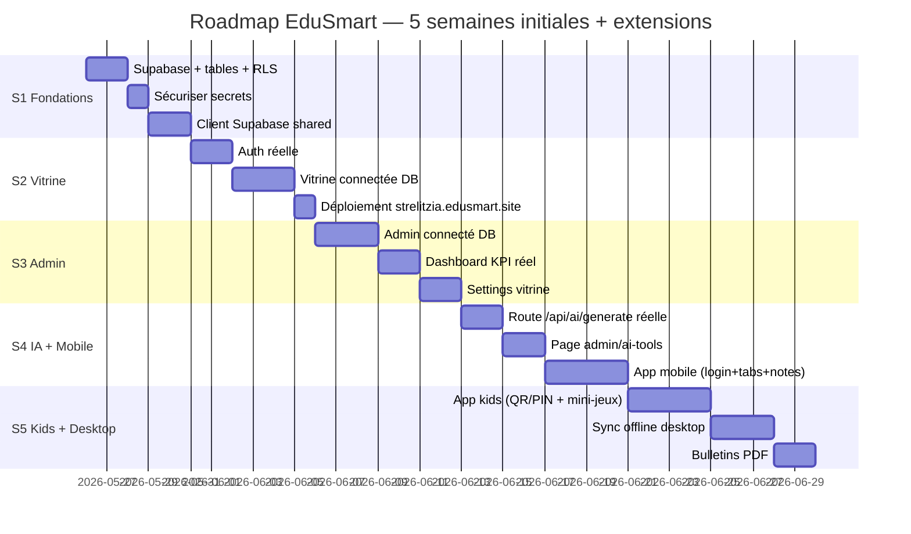

# ROADMAP — EduSmart

> Roadmap consolidée (5 semaines × 35 tâches) + extensions Phase 2/3.
> Aligner avec [NEXT_ACTIONS](NEXT_ACTIONS.md) (priorisation P0–P3) et [/tasks](../../tasks/) (étapes exécutables).

---

## 1. Vue globale

---

## 2. Semaine 1 — Fondations data (P0)

| # | Tâche | Sortie | STEP |
|---|---|---|---|
| 1 | Créer projet Supabase (Singapore) | URL + 3 clés | [STEP_01](../../tasks/STEP_01.md) |
| 2 | Exécuter `0001_init.sql` | 12 tables créées | [STEP_01](../../tasks/STEP_01.md) |
| 3 | Exécuter `0002_rls.sql` | RLS active partout | [STEP_01](../../tasks/STEP_01.md) |
| 4 | Seed STRELITZIA + UAZ | 2 orgas + 10 élèves | [STEP_01](../../tasks/STEP_01.md) |
| 5 | Configurer Auth (SMTP Resend, redirects) | Email confirmation fonctionne | [STEP_01](../../tasks/STEP_01.md) |
| 6 | Audit secrets + rotation | `.env.example` propre | [STEP_02](../../tasks/STEP_02.md) |
| 7 | `packages/shared/supabase/{client,server,middleware,types}.ts` | Imports `@edusmart/shared` OK | [STEP_03](../../tasks/STEP_03.md) |
| 8 | Adapter middleware admin/vitrine (refresh session) | Cookies propagés | [STEP_03](../../tasks/STEP_03.md) |
| 9 | Push + vérifier `test.edusmart.site` | Pas de régression | — |

---

## 3. Semaine 2 — Vitrine + Auth (P0/P1)

| # | Tâche | STEP |
|---|---|---|
| 10 | `apps/admin/login/page.tsx` + Server Actions | [STEP_04](../../tasks/STEP_04.md) |
| 11 | `apps/vitrine/auth/callback/route.ts` (OAuth shared) | [STEP_04](../../tasks/STEP_04.md) |
| 12 | Helpers `getCurrentProfile`, `requireRole`, `redirectByRole` | [STEP_04](../../tasks/STEP_04.md) |
| 13 | Anti cross-tenant dans `getAdminTenant` | [STEP_04](../../tasks/STEP_04.md) |
| 14 | Vitrine `getOrganizationBySlug` → Supabase | [STEP_05](../../tasks/STEP_05.md) |
| 15 | Pages `/programs`, `/news`, `/news/[id]` connectées DB | [STEP_05](../../tasks/STEP_05.md) |
| 16 | Formulaire `/inscription` → school_requests | [STEP_05](../../tasks/STEP_05.md) |
| 17 | `/api/contact` → Resend + table | [STEP_05](../../tasks/STEP_05.md) |
| 18 | Theming dynamique CSS vars | [STEP_05](../../tasks/STEP_05.md) |
| 19 | Déploiement Vercel `vitrine` → strelitzia.edusmart.site | — |
| 20 | Test multi-tenant prod (strelitzia vs uaz) | — |

---

## 4. Semaine 3 — Admin connecté (P1)

| # | Tâche | STEP |
|---|---|---|
| 21 | `/admin` dashboard avec KPI réels (élèves, notes, alertes) | [STEP_06](../../tasks/STEP_06.md) |
| 22 | `/admin/students` CRUD complet + Server Actions | [STEP_06](../../tasks/STEP_06.md) |
| 23 | `/admin/grades` saisie + calcul moyennes (`gradeCalc.ts`) | [STEP_06](../../tasks/STEP_06.md) |
| 24 | `/admin/settings` (orga : nom, logo, couleurs) | [STEP_06](../../tasks/STEP_06.md) |
| 25 | `/admin/settings/vitrine` (sections visibles, SEO) | [STEP_06](../../tasks/STEP_06.md) |
| 26 | Upload logo → Supabase Storage | [STEP_06](../../tasks/STEP_06.md) |
| 27 | Validation `zod` sur toutes les Server Actions | — |
| 28 | CLAUDE.md racine + sous-CLAUDE.md (admin, vitrine, shared, desktop) | — |

---

## 5. Semaine 4 — IA + Mobile (P2)

| # | Tâche | STEP |
|---|---|---|
| 29 | `/api/ai/generate` réelle OpenRouter streaming SSE | [STEP_07](../../tasks/STEP_07.md) |
| 30 | `/admin/ai-tools` page (6 outils) | [STEP_07](../../tasks/STEP_07.md) |
| 31 | Persistance `ai_conversations` | [STEP_07](../../tasks/STEP_07.md) |
| 32 | `apps/mobile` login email/password + Magic Link | [STEP_08](../../tasks/STEP_08.md) |
| 33 | Tabs : Notes / Devoirs / Messages / Profil | [STEP_08](../../tasks/STEP_08.md) |
| 34 | Écran notes + graphiques (`victory-native`) | [STEP_08](../../tasks/STEP_08.md) |
| 35 | Notifications push Realtime + Expo Notifications | [STEP_12](../../tasks/STEP_12.md) |

---

## 6. Semaine 5 — Kids + Desktop (P2)

| # | Tâche | STEP |
|---|---|---|
| 36 | `apps/kids` login QR Code (camera + JWT signé) | [STEP_09](../../tasks/STEP_09.md) |
| 37 | `apps/kids` login code+PIN | [STEP_09](../../tasks/STEP_09.md) |
| 38 | Mini-jeux QCM + DragDrop (4-5 jeux) | [STEP_09](../../tasks/STEP_09.md) |
| 39 | Sync quiz admin → kids (Realtime + cache MMKV) | [STEP_09](../../tasks/STEP_09.md) |
| 40 | Desktop : IPC channels (auth, db, sync, print) | [STEP_10](../../tasks/STEP_10.md) |
| 41 | Desktop : SQLite local + worker sync 5min | [STEP_10](../../tasks/STEP_10.md) |
| 42 | Desktop : saisie notes en grille (Excel-like) | [STEP_10](../../tasks/STEP_10.md) |
| 43 | Génération bulletins PDF (`@react-pdf/renderer`) | [STEP_11](../../tasks/STEP_11.md) |
| 44 | Impression depuis desktop | [STEP_11](../../tasks/STEP_11.md) |

---

## 7. Extensions Phase 2 — Qualité & monitoring (P3)

| # | Tâche | STEP |
|---|---|---|
| 45 | Tests unitaires Vitest (`packages/shared` + helpers) | [STEP_13](../../tasks/STEP_13.md) |
| 46 | Tests composants Testing Library (shells, formulaires) | [STEP_13](../../tasks/STEP_13.md) |
| 47 | Tests E2E Playwright (login, multi-tenant, saisie note) | [STEP_13](../../tasks/STEP_13.md) |
| 48 | CI étendue (admin + vitrine + desktop + lint + tests) | [STEP_14](../../tasks/STEP_14.md) |
| 49 | Sentry (web + mobile) | [STEP_14](../../tasks/STEP_14.md) |
| 50 | Vercel Analytics + Plausible | [STEP_14](../../tasks/STEP_14.md) |
| 51 | Rate-limit `/api/chat` et `/api/ai/generate` | [STEP_14](../../tasks/STEP_14.md) |
| 52 | Edge Function `on_school_approved` | [STEP_14](../../tasks/STEP_14.md) |
| 53 | Edge Function `cron_dropout_detection` | [STEP_14](../../tasks/STEP_14.md) |

---

## 8. Extensions Phase 3 — Déploiement réel (P3)

| # | Tâche | STEP |
|---|---|---|
| 54 | Pilote 1 école réelle (STRELITZIA Toamasina) | [STEP_15](../../tasks/STEP_15.md) |
| 55 | Import CSV élèves existants | [STEP_15](../../tasks/STEP_15.md) |
| 56 | Formation directeur + 3 enseignants | [STEP_15](../../tasks/STEP_15.md) |
| 57 | Mesure KPI : temps bulletins, détection décrochage | [STEP_15](../../tasks/STEP_15.md) |
| 58 | Migration `edusmart.site` → `edusmart.mg` | [STEP_15](../../tasks/STEP_15.md) |
| 59 | Soumission App Store + Play Store | [STEP_15](../../tasks/STEP_15.md) |
| 60 | 2FA TOTP pour super_admin + director | — |
| 61 | Abonnements écoles (Stripe B2B) | — |
| 62 | App Google OAuth en Production (sortie Testing) | — |

---

## 9. Estimations & jalons

| Jalon | Date cible | Critère |
|---|---|---|
| **M1 — Backend prêt** | +1 semaine | Supabase + 12 tables + auth fonctionnelle |
| **M2 — Vitrine multi-tenant prod** | +2 semaines | strelitzia.edusmart.site avec vraies données |
| **M3 — Admin opérationnel** | +3 semaines | Saisie notes, calcul moyennes, settings |
| **M4 — Pilote école** | +6 semaines | 1 école utilise réellement (10+ utilisateurs) |
| **M5 — Apps mobiles publiées** | +10 semaines | iOS + Android dispos sur stores |
| **M6 — Soutenance mémoire** | TBD | Démo live + KPI mesurés |

---

## 10. Risques & mitigations

| Risque | Probabilité | Impact | Mitigation |
|---|:-:|:-:|---|
| Délai Supabase migration plus long que prévu | Faible | Moyen | Garder mock-data activable en fallback |
| Apple App Store rejette l'app kids (raisons mineures) | Moyen | Faible | Compter +2 semaines, soumettre tôt |
| Adoption parents lente (faible smartphone Madagascar) | Moyen | Élevé | Garder le SMS + l'email comme canal principal |
| Connectivité instable terrain → sync desktop critique | Élevé | Élevé | Tests offline rigoureux, queue robuste |
| Évolution Next.js 14 → 15 casse l'API | Moyen | Faible | Rester sur 14.2 jusqu'à phase 3 |
| Quota Supabase Free dépassé (gros seed) | Faible | Faible | Passer Pro à $25/mois (acceptable) |

---

## 11. Liens

- ▶️ [NEXT_ACTIONS](NEXT_ACTIONS.md) — Priorisation P0–P3
- 📋 [TASKS_GLOBAL](../11-tasks/TASKS_GLOBAL.md)
- 📌 [tasks/](../../tasks/) — STEPS exécutables
- 🗂️ [MASTER_INDEX](../MASTER_INDEX.md)
