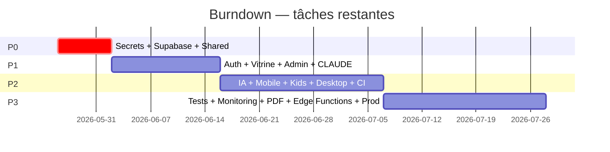

# TASKS GLOBAL — EduSmart

> Liste consolidée de **toutes les tâches** du projet, priorisées et croisées avec les STEPS exécutables.
> Source de vérité opérationnelle pour le suivi de progression.

---

## 1. Vue par priorité

### 🔴 P0 — Bloquant (3 items)

| ID | Tâche | STEP | État |
|---|---|---|:-:|
| P0-1 | Régénérer les secrets exposés dans `.env.example` | [STEP_02](../../tasks/STEP_02.md) | 🔴 |
| P0-2 | Créer projet Supabase + 12 tables + RLS | [STEP_01](../../tasks/STEP_01.md) | 🔴 |
| P0-3 | Implémenter client Supabase dans `packages/shared` | [STEP_03](../../tasks/STEP_03.md) | 🔴 |

### 🟠 P1 — Important (4 items)

| ID | Tâche | STEP | État |
|---|---|---|:-:|
| P1-1 | Auth Supabase réelle (remplacer login mock) | [STEP_04](../../tasks/STEP_04.md) | 🔴 |
| P1-2 | Vitrine connectée Supabase | [STEP_05](../../tasks/STEP_05.md) | 🔴 |
| P1-3 | Admin connecté Supabase | [STEP_06](../../tasks/STEP_06.md) | 🔴 |
| P1-4 | CLAUDE.md racine + sous-CLAUDE.md | — | 🔴 |

### 🟡 P2 — Amélioration (5 items)

| ID | Tâche | STEP | État |
|---|---|---|:-:|
| P2-1 | `/api/ai/generate` réelle OpenRouter | [STEP_07](../../tasks/STEP_07.md) | 🔴 |
| P2-2 | App mobile (login + tabs + notes + push) | [STEP_08](../../tasks/STEP_08.md), [STEP_12](../../tasks/STEP_12.md) | 🔴 |
| P2-3 | App kids (QR/PIN + mini-jeux) | [STEP_09](../../tasks/STEP_09.md) | 🔴 |
| P2-4 | Sync offline desktop SQLite + IPC | [STEP_10](../../tasks/STEP_10.md) | 🔴 |
| P2-5 | CI étendue admin/vitrine/desktop | [STEP_14](../../tasks/STEP_14.md) | 🟡 partiel |

### 🟢 P3 — Polish (8 items)

| ID | Tâche | STEP | État |
|---|---|---|:-:|
| P3-1 | Génération bulletins PDF | [STEP_11](../../tasks/STEP_11.md) | 🔴 |
| P3-2 | Rate-limit `/api/chat` et `/api/ai/generate` | [STEP_14](../../tasks/STEP_14.md) | 🔴 |
| P3-3 | Sentry + Vercel Analytics + Plausible | [STEP_14](../../tasks/STEP_14.md) | 🔴 |
| P3-4 | Tests unitaires + E2E Playwright | [STEP_13](../../tasks/STEP_13.md) | 🔴 |
| P3-5 | Edge Function `on_school_approved` | [STEP_14](../../tasks/STEP_14.md) | 🔴 |
| P3-6 | Edge Function `cron_dropout_detection` | [STEP_14](../../tasks/STEP_14.md) | 🔴 |
| P3-7 | Migration `edusmart.site` → `edusmart.mg` | [STEP_15](../../tasks/STEP_15.md) | 🔴 |
| P3-8 | App Google OAuth en Production | — | 🔴 |

---

## 2. Tâches d'hygiène (rapides, faible effort)

| Tâche | Effort | Bloquant ? |
|---|---|---|
| Choisir un seul package manager (pnpm) → supprimer `package-lock.json` | 1 min | non |
| Déplacer les 8 fichiers `Export*.md` / `RAPPORT_*.md` vers `docs/17-ai-analysis/` | 5 min | non |
| Mettre à jour `.claude/settings.json` (`claude-opus-4-5` → `claude-opus-4-7`) | 1 min | non |
| Ajouter un `tsconfig.base.json` racine | 15 min | non |
| Ajouter `@next/bundle-analyzer` | 30 min | non |
| Renforcer le middleware tenancy (whitelist + 404 strict) | 30 min | non |
| Extraire `AdminShell` + `SchoolShell` vers `packages/ui` | 1h | non |

---

## 3. Tâches transverses (cross-cutting)

| Tâche | Apps concernées | Étapes |
|---|---|---|
| Internationalisation (fr-FR + mg-MG) | toutes | post-P3 |
| Accessibilité WCAG AA | web, mobile | continue |
| Optimisation images vitrine (`next/image`) | vitrine | P2 |
| Code splitting & lazy loading | toutes | P2 |
| Logging structuré (pino) | API routes | P2 |
| Audit Lighthouse périodique | vitrine, admin | P2 |

---

## 4. Mapping tâche → STEP exécutable

| STEP | Tâches couvertes |
|---|---|
| [STEP_01](../../tasks/STEP_01.md) | Créer Supabase + 12 tables + RLS + seed + auth config |
| [STEP_02](../../tasks/STEP_02.md) | Audit secrets + rotation + push protection GitHub |
| [STEP_03](../../tasks/STEP_03.md) | Client Supabase + types + data helpers |
| [STEP_04](../../tasks/STEP_04.md) | Auth réelle web + Google OAuth + cross-tenant |
| [STEP_05](../../tasks/STEP_05.md) | Vitrine DB + formulaires + theming dynamique |
| [STEP_06](../../tasks/STEP_06.md) | Admin DB (students, grades, settings, upload logo) |
| [STEP_07](../../tasks/STEP_07.md) | IA OpenRouter streaming + page admin/ai-tools |
| [STEP_08](../../tasks/STEP_08.md) | Mobile login + tabs + notes |
| [STEP_09](../../tasks/STEP_09.md) | Kids QR + PIN + mini-jeux + sync quiz |
| [STEP_10](../../tasks/STEP_10.md) | Desktop IPC + SQLite + sync 5min |
| [STEP_11](../../tasks/STEP_11.md) | Bulletins PDF + impression |
| [STEP_12](../../tasks/STEP_12.md) | Notifications push Realtime + Expo |
| [STEP_13](../../tasks/STEP_13.md) | Tests unitaires + E2E Playwright |
| [STEP_14](../../tasks/STEP_14.md) | CI étendue + monitoring + rate-limit + Edge Functions |
| [STEP_15](../../tasks/STEP_15.md) | Déploiement production multi-école + edusmart.mg |

---

## 5. Burndown projeté (8-10 semaines)

---

## 6. Liens

- ▶️ [NEXT_ACTIONS](../10-roadmap/NEXT_ACTIONS.md)
- 🗺️ [ROADMAP](../10-roadmap/ROADMAP.md)
- 📌 [tasks/](../../tasks/)
- 🗂️ [MASTER_INDEX](../MASTER_INDEX.md)
