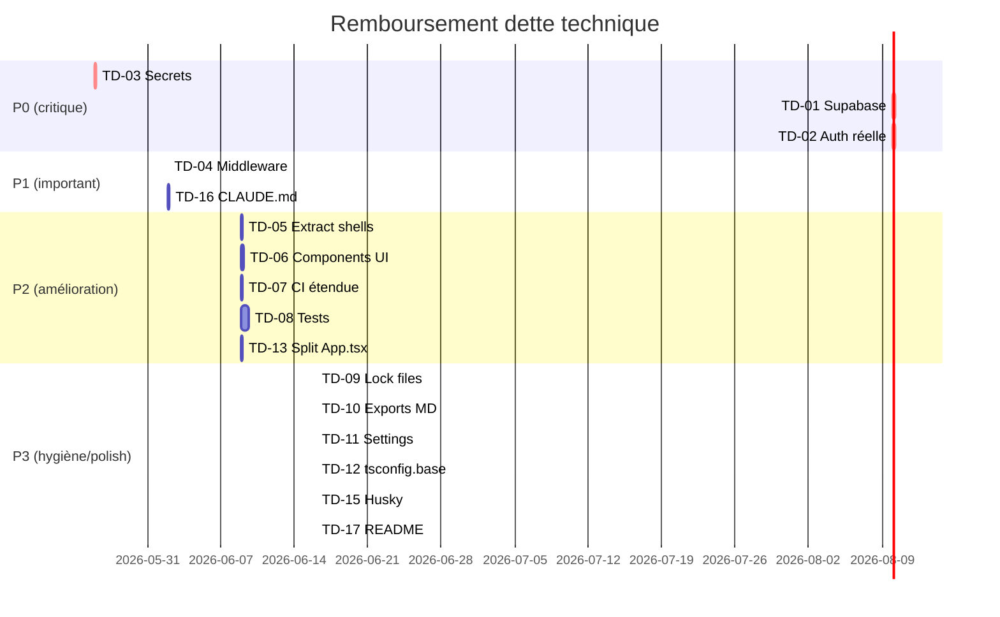

# TECH DEBT — EduSmart

> Inventaire des dettes techniques identifiées + plan de remboursement.
> Chaque dette a un **coût estimé** (effort pour la résoudre) et un **impact** (risque si ignorée).

---

## 1. Dette critique (à rembourser P0/P1)

### TD-01 — Aucune persistance réelle (tout est mock)

**Description** : `@supabase/supabase-js@2.105` est installé mais **aucun client n'est instancié**. Toutes les apps consomment `mock-data.ts`.

**Impact** : 🔴 **Bloquant total** — aucune démo crédible, aucun élève réel, aucun KPI mesurable.

**Coût** : ~6h (STEP_03).

**Remboursement** : [STEP_03](../../tasks/STEP_03.md).

---

### TD-02 — Login admin hardcodé

**Description** : `apps/admin/src/app/login/page.tsx` accepte `directeur@strelitzia.test` / `Test1234!` codé en dur.

**Impact** : 🔴 **Critique sécurité** — n'importe qui peut accéder à l'admin en production.

**Coût** : ~5h (STEP_04).

**Remboursement** : [STEP_04](../../tasks/STEP_04.md).

---

### TD-03 — Secrets potentiellement exposés dans `.env.example`

**Description** : Le fichier `.env.example` peut contenir de vraies clés (JWT Supabase, OpenRouter, Resend, Twilio) — observation lors du scan initial.

**Impact** : 🔴 **Critique sécurité** — leak si repo public ou clone interne mal contrôlé.

**Coût** : ~2h (STEP_02 — audit + rotation).

**Remboursement** : [STEP_02](../../tasks/STEP_02.md).

---

## 2. Dette importante (P1-P2)

### TD-04 — Middleware fallback silencieux

**Description** : Si un slug invalide est passé (ex: `xyz.edusmart.site`), le middleware retombe sur `strelitzia` au lieu de retourner 404.

**Impact** : 🟡 Cross-tenant accidentel (UX en utilisant le mauvais nom d'école), fuite d'info.

**Coût** : ~30 min — whitelist d'organisations + 404 explicite.

**Remboursement** : à inclure dans [STEP_03](../../tasks/STEP_03.md) ou [STEP_04](../../tasks/STEP_04.md).

```ts
// Avant
const slug = host.replace(`.${rootDomain}`, '') || 'strelitzia'

// Après
const slug = host.replace(`.${rootDomain}`, '')
if (!slug || !VALID_SLUGS.has(slug)) {
  return NextResponse.rewrite(new URL('/404', req.url))
}
```

---

### TD-05 — `AdminShell` et `SchoolShell` dupliqués

**Description** : Composants layout (sidebar, header, footer) copiés entre `apps/admin/src/components/admin-shell.tsx` et `apps/vitrine/src/components/school-shell.tsx`.

**Impact** : 🟡 Maintenance double, divergence inévitable.

**Coût** : ~2h — extraire vers `packages/ui/src/components/`.

**Remboursement** : P2 (après stabilisation Auth et DB).

---

### TD-06 — `packages/ui` quasi vide

**Description** : Le package n'exporte que des tokens (`COLORS`, `FONTS`). `/components/` est vide.

**Impact** : 🟡 DRY violé, pas de design system centralisé.

**Coût** : ~4h — extraire Button, Card, Modal, FormField, DataTable depuis admin/vitrine.

**Remboursement** : P2.

---

### TD-07 — CI ne couvre que `apps/test`

**Description** : `.github/workflows/ci.yml` ne build et type-check **que `@edusmart/test`**. Admin, vitrine, desktop, mobile peuvent casser sans détection.

**Impact** : 🟡 Régressions silencieuses.

**Coût** : ~1h — étendre la matrice CI.

**Remboursement** : [STEP_14](../../tasks/STEP_14.md).

---

### TD-08 — Aucun test unitaire ni E2E

**Description** : 0 fichier de test dans tout le repo.

**Impact** : 🟡 Refactors risqués, confiance basse au moment de brancher Supabase.

**Coût** : ~16h — setup Vitest + Playwright + tests minimum (auth flow, multi-tenant, calcul moyenne).

**Remboursement** : [STEP_13](../../tasks/STEP_13.md).

---

## 3. Dette d'hygiène (rapide)

### TD-09 — Coexistence `package-lock.json` et `pnpm-lock.yaml`

**Description** : Les deux lock files coexistent à la racine.

**Impact** : 🟢 Confusion deps, risque de désync.

**Coût** : 1 min.

```bash
rm package-lock.json
git rm package-lock.json
git commit -m "chore: drop package-lock.json (using pnpm)"
```

---

### TD-10 — 8 fichiers `Export*.md` / `RAPPORT_*.md` à la racine

**Description** : Pollution racine. Devraient être archivés dans `docs/17-ai-analysis/`.

**Impact** : 🟢 Lisibilité repo dégradée.

**Coût** : 5 min.

```bash
mkdir -p docs/17-ai-analysis/_exports/
git mv "Export V3 Final généré.md" docs/17-ai-analysis/_exports/
git mv "Export généré.md" docs/17-ai-analysis/_exports/
# ... idem pour les autres
```

---

### TD-11 — `.claude/settings.json` référence modèle obsolète

**Description** : `claude-opus-4-5` n'existe pas / est obsolète. Devrait être `claude-opus-4-7`.

**Impact** : 🟢 Erreur au démarrage Claude Code (silencieuse).

**Coût** : 1 min.

---

### TD-12 — Pas de `tsconfig.base.json` racine

**Description** : Chaque app a son `tsconfig.json` complet. Les options communes (strict mode, target, paths) sont dupliquées.

**Impact** : 🟢 Divergence possible des règles TypeScript.

**Coût** : ~15 min — créer `tsconfig.base.json` et faire `extends`.

---

### TD-13 — `apps/desktop/src/App.tsx` monolithique (~1000 lignes)

**Description** : Tout le dashboard est dans un seul fichier.

**Impact** : 🟢 Maintenance difficile, perf React (re-renders).

**Coût** : ~3h — découper en `<DashboardHeader>`, `<DashboardSidebar>`, `<MetricsGrid>`, `<TasksQueue>`, `<StudentsTable>`.

**Remboursement** : à faire avant [STEP_10](../../tasks/STEP_10.md) (sync offline) pour éviter d'agrandir encore.

---

### TD-14 — Apps mobile et kids sont des stubs Expo

**Description** : Aucun code métier, juste `App.tsx` par défaut Expo.

**Impact** : 🟢 Normal en phase de scaffolding, mais à planifier.

**Coût** : ~16h chacune (STEP_08, STEP_09).

---

### TD-15 — Pas de Husky / lint-staged

**Description** : Aucun pre-commit hook, on peut commiter du code qui casse le lint ou le type-check.

**Impact** : 🟢 PRs avec erreurs basiques.

**Coût** : ~30 min.

```bash
pnpm add -D -w husky lint-staged
npx husky init
# .husky/pre-commit : pnpm lint-staged
```

---

## 4. Dette de documentation

### TD-16 — Pas de `CLAUDE.md` racine ni sous-CLAUDE.md

**Description** : Les guides EduSmart recommandent un `CLAUDE.md` par app pour discipliner les sessions Claude Code. Aucun n'existe.

**Impact** : 🟡 Sessions Claude moins efficaces, conventions non rappelées.

**Coût** : ~2h — écrire 5 fichiers (racine + admin + vitrine + desktop + shared).

**Remboursement** : P1.

---

### TD-17 — README racine minimal (6 lignes)

**Description** : Le `README.md` actuel n'a pas de section installation/usage/contribution.

**Impact** : 🟢 Onboarding nouveau dev difficile.

**Coût** : ~30 min.

---

## 5. Dette de sécurité (transverse)

| Dette | Détail | Coût | Phase |
|---|---|---|---|
| Pas de rate-limit `/api/chat`, `/api/ai/generate` | Risque DoS / facture OpenRouter explosive | 2h | P3 |
| Pas de validation `zod` sur Server Actions | Risque injection / payloads malformés | 4h | P2 |
| Pas de CSP / security headers | Permissif par défaut | 1h | P3 |
| Pas de 2FA pour `super_admin` / `director` | Compromission compte = catastrophe | 4h | P3 |
| Pas d'audit log `auth_events` | Pas de visibilité sur les incidents | 3h | P3 |

---

## 6. Dette de performance

| Dette | Détail | Coût | Phase |
|---|---|---|---|
| Pas de mesure bundles | Aucune visibilité sur la taille | 30 min | P3 |
| Pas d'ISR / cache CDN custom | Toutes pages SSR à chaque req | inclus STEP_05 | P1 |
| Pas d'images optimisées vitrine (`next/image`) | Bandwidth gaspillé | 1h | P2 |
| `App.tsx` desktop monolithique → re-render lourd | UI laggy quand données | 3h (TD-13) | P2 |

---

## 7. Plan de remboursement global



---

## 8. Total estimé

| Catégorie | Effort cumulé |
|---|---|
| P0 critiques | ~13h |
| P1 importants | ~2.5h |
| P2 améliorations | ~26h |
| P3 hygiène | ~1.5h |
| **Total** | **~43h (~5.5 jours-homme)** |

---

## 9. Méta — comment éviter d'accumuler de la nouvelle dette

1. **Code review obligatoire** sur tout PR (même solo, relire avant merge).
2. **Tests minimum** pour toute fonctionnalité critique (auth, RLS, calculs).
3. **Pas de `TODO` orphelin** — toujours lié à une issue / ticket.
4. **Pas de `any`** dans le code production (lint rule).
5. **Pas de `console.log`** dans les builds prod (Sentry à la place).
6. **PR petite** (< 400 lignes diff) — refus de merger les "PR fleuves".
7. **Refactor inclus** quand on touche un fichier (boy scout rule).

---

## 10. Liens

- 🐛 [BUGS_AND_FIXES](BUGS_AND_FIXES.md)
- 🛡️ [SECURITY_REPORT](../14-security/SECURITY_REPORT.md)
- ⚡ [PERFORMANCE_REPORT](../15-performance/PERFORMANCE_REPORT.md)
- 📊 [CURRENT_STATE](../01-overview/CURRENT_STATE.md)
