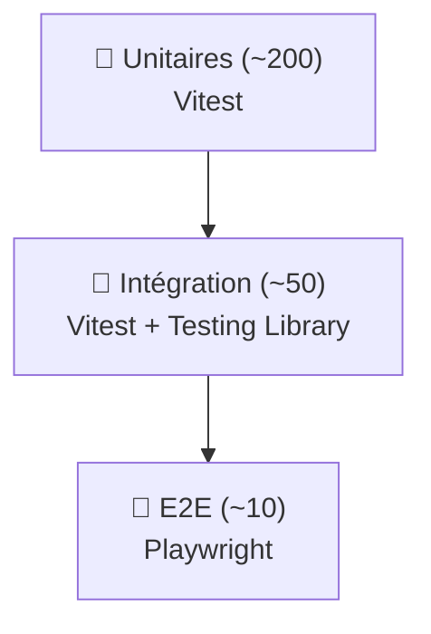

# TESTING — EduSmart

> Stratégie de tests pour le monorepo. **État actuel : aucun test n'existe**.
> Cible : pyramide classique (beaucoup unitaires, moyens intégration, peu E2E).

---

## 1. Pyramide cible



| Type | Combien | Outil | Quand |
|---|---|---|---|
| Unitaires | ~200 | Vitest | Logique pure (utils, validators, helpers) |
| Intégration | ~50 | Vitest + Testing Library | Composants + Server Actions |
| E2E | ~10 | Playwright | Parcours critiques bout en bout |

---

## 2. Stack de test

| Type | Outil | Pourquoi |
|---|---|---|
| Test runner | **Vitest** | Rapide, ESM natif, compatible TS, API Jest-like |
| Composants React | **@testing-library/react** | Tests comportementaux pas implémentation |
| Mocks réseau | **MSW** (Mock Service Worker) | Intercepter fetch sans monkey-patching |
| E2E | **Playwright** | Multi-browser, headless, screenshots, traces |
| Coverage | **vitest --coverage (v8)** | Rapport HTML |
| Visual regression (P3) | **Chromatic** ou Playwright `toHaveScreenshot` | Détection régressions UI |
| Load testing (P3) | **k6** | Simuler 100+ users concurrents |

---

## 3. Setup minimum

### Racine
```bash
pnpm add -D -w vitest @vitest/coverage-v8 happy-dom
```

### `vitest.config.ts` racine
```ts
import { defineConfig } from 'vitest/config'

export default defineConfig({
  test: {
    environment: 'happy-dom',
    globals: true,
    coverage: {
      provider: 'v8',
      reporter: ['text', 'html'],
      include: ['packages/**/src/**', 'apps/**/src/**'],
      exclude: ['**/node_modules/**', '**/.next/**', '**/dist/**'],
    },
  },
})
```

### Scripts par package
```json
{
  "scripts": {
    "test":          "vitest",
    "test:watch":    "vitest watch",
    "test:coverage": "vitest --coverage"
  }
}
```

---

## 4. Tests prioritaires à écrire

### Unitaires (`packages/shared`)

```ts
// packages/shared/src/utils/gradeCalc.test.ts
import { describe, it, expect } from 'vitest'
import { calculateAverage } from './gradeCalc'

describe('calculateAverage', () => {
  it('retourne 0 si aucune note', () => {
    expect(calculateAverage([])).toBe(0)
  })

  it('calcule la moyenne pondérée correctement', () => {
    const grades = [
      { value: 12, max_value: 20, coefficient: 2 },
      { value: 16, max_value: 20, coefficient: 1 },
    ]
    // (12*2 + 16*1) / (2+1) = 40/3 = 13.33
    expect(calculateAverage(grades)).toBeCloseTo(13.33, 2)
  })

  it('normalise quand max_value différent de 20', () => {
    const grades = [{ value: 8, max_value: 10, coefficient: 1 }]
    expect(calculateAverage(grades)).toBe(16)  // 8/10 * 20
  })
})
```

```ts
// packages/shared/src/utils/slugify.test.ts
import { describe, it, expect } from 'vitest'
import { slugify } from './slugify'

describe('slugify', () => {
  it('normalise les accents', () => {
    expect(slugify('École Adventiste Zürcher')).toBe('ecole-adventiste-zurcher')
  })
  it('garde les chiffres', () => {
    expect(slugify('Lycée 2025')).toBe('lycee-2025')
  })
})
```

### Intégration (Server Actions)

```ts
// apps/admin/src/app/students/actions.test.ts
import { describe, it, expect, vi } from 'vitest'
import { createStudent } from './actions'

vi.mock('@edusmart/shared', async () => ({
  createSupabaseServerClient: () => ({
    from: () => ({
      insert: vi.fn().mockReturnThis(),
      select: vi.fn().mockResolvedValue({ data: [{ id: 'mock' }] }),
    }),
  }),
}))

describe('createStudent', () => {
  it('refuse un payload sans first_name', async () => {
    const fd = new FormData()
    fd.set('last_name', 'Doe')
    const result = await createStudent(fd)
    expect(result.error).toBeDefined()
  })
})
```

### E2E (Playwright)

```ts
// e2e/admin-login.spec.ts
import { test, expect } from '@playwright/test'

test('login director STRELITZIA redirige vers le dashboard', async ({ page }) => {
  await page.goto('http://localhost:3002?school=strelitzia')
  await page.fill('input[name=email]',    'directeur@strelitzia.test')
  await page.fill('input[name=password]', process.env.TEST_DIRECTOR_PASSWORD!)
  await page.click('button[type=submit]')
  await expect(page).toHaveURL(/\/admin$/)
  await expect(page.locator('h1')).toContainText('STRELITZIA')
})

test('director STRELITZIA ne peut PAS accéder à uaz.edusmart.site', async ({ page, context }) => {
  // (login préalable via storageState)
  await page.goto('http://localhost:3002?school=uaz')
  await expect(page).toHaveURL(/\/forbidden$/)
})
```

---

## 5. Scénarios critiques à couvrir absolument

| Scénario | Type | STEP |
|---|---|---|
| Login email/password OK | E2E | [STEP_13](../../tasks/STEP_13.md) |
| Login Google OAuth multi-tenant | E2E | [STEP_13](../../tasks/STEP_13.md) |
| Cross-tenant bloqué (STRELITZIA ne voit pas UAZ) | E2E | [STEP_13](../../tasks/STEP_13.md) |
| RLS isolation tables sensibles | intégration SQL | [STEP_13](../../tasks/STEP_13.md) |
| Calcul moyenne ponderée | unitaire | déjà ci-dessus |
| Slugify accents/spaces | unitaire | déjà ci-dessus |
| Server Action validation `zod` (payload invalide) | intégration | [STEP_13](../../tasks/STEP_13.md) |
| Formulaire `/inscription` insère school_request | intégration | [STEP_13](../../tasks/STEP_13.md) |
| Streaming SSE `/api/ai/generate` envoie bien des chunks | intégration | [STEP_13](../../tasks/STEP_13.md) |
| Middleware résout slug correctement (`__root__`, localhost ?, prod) | unitaire | [STEP_13](../../tasks/STEP_13.md) |

---

## 6. Mocks recommandés (MSW)

```ts
// test/mocks/handlers.ts
import { http, HttpResponse } from 'msw'

export const handlers = [
  http.get('*/rest/v1/organizations*', () => HttpResponse.json([
    { id: '1', slug: 'strelitzia', name: 'STRELITZIA SCHOOL', city: 'Toamasina' },
    { id: '2', slug: 'uaz',         name: 'UAZ',               city: 'Antananarivo' },
  ])),
  http.post('*/auth/v1/token*', () => HttpResponse.json({
    access_token: 'mock', refresh_token: 'mock',
    user: { id: 'mock-user', email: 'test@example.com' },
  })),
]
```

---

## 7. CI test

```yaml
# .github/workflows/test.yml (P2)
name: Tests
on: [pull_request, push]
jobs:
  unit:
    runs-on: ubuntu-latest
    steps:
      - uses: actions/checkout@v4
      - uses: pnpm/action-setup@v3
      - uses: actions/setup-node@v4
        with: { node-version: '20' }
      - run: pnpm install --frozen-lockfile
      - run: pnpm -r test
      - run: pnpm -r test:coverage --reporter=json
  e2e:
    runs-on: ubuntu-latest
    services:
      supabase:
        image: supabase/postgres
    steps:
      - uses: actions/checkout@v4
      - run: pnpm install --frozen-lockfile
      - run: npx playwright install --with-deps chromium
      - run: pnpm --filter @edusmart/admin build
      - run: pnpm --filter @edusmart/admin start &
      - run: pnpm e2e
```

---

## 8. Conventions

- **1 fichier de test par fichier source**, suffixe `.test.ts` ou `.test.tsx`.
- **Arrange / Act / Assert** explicite.
- **Pas de logique partagée dans `beforeEach`** (sauf setup factice trivial) — lisibilité prime.
- **Tester le comportement, pas l'implémentation** : `getByRole`, `getByLabelText` plutôt que `getByTestId`.
- **Fixtures réutilisables** dans `test/fixtures/` (1 user STRELITZIA, 1 user UAZ, 1 set de 5 grades).
- **Pas de tests qui dépendent du réseau réel** (sauf E2E sur preview Vercel).

---

## 9. Coverage cible

| Package | Cible coverage statements |
|---|---|
| `packages/shared` | > 90 % |
| `packages/ui` | > 80 % |
| `apps/admin` (Server Actions + helpers) | > 70 % |
| `apps/vitrine` | > 60 % |
| `apps/desktop` | > 50 % |
| `apps/mobile` / `apps/kids` | > 50 % (P2) |

Pas d'objectif sur les fichiers de config / boilerplate.

---

## 10. Plan d'implémentation

1. **STEP_13** — Setup Vitest + 20 tests unitaires sur `packages/shared`.
2. **STEP_13** — 10 tests intégration sur Server Actions admin.
3. **STEP_13** — 5 scénarios E2E Playwright (login, multi-tenant, saisie note).
4. **STEP_14** — CI test sur PR.
5. P3 — Coverage badge dans README.
6. P3 — Visual regression Chromatic ou Playwright snapshots.

---

## 11. Liens

- 📌 [tasks/STEP_13](../../tasks/STEP_13.md) — Implémenter les tests
- 📌 [tasks/STEP_14](../../tasks/STEP_14.md) — Étendre la CI
- 🐛 [TECH_DEBT TD-08](../12-bugs/TECH_DEBT.md#td-08--aucun-test-unitaire-ni-e2e)
