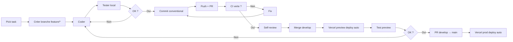
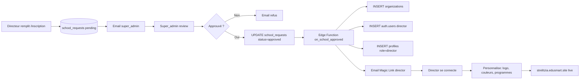
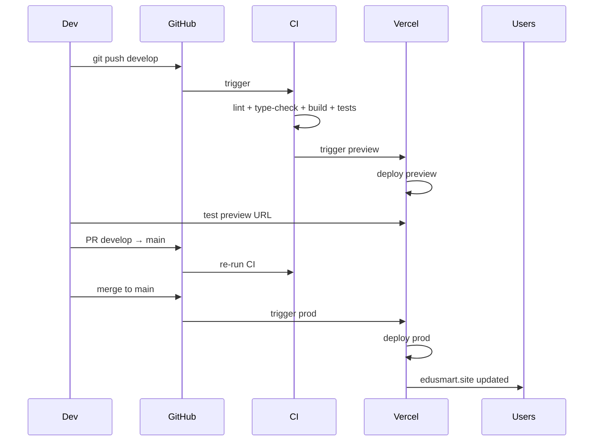
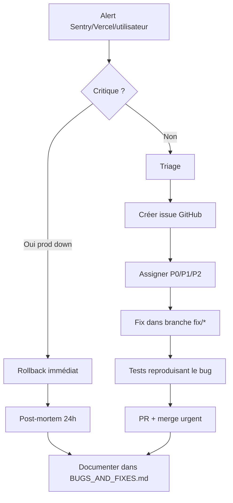
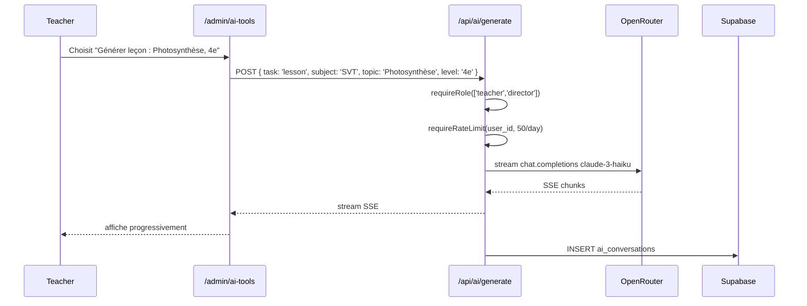
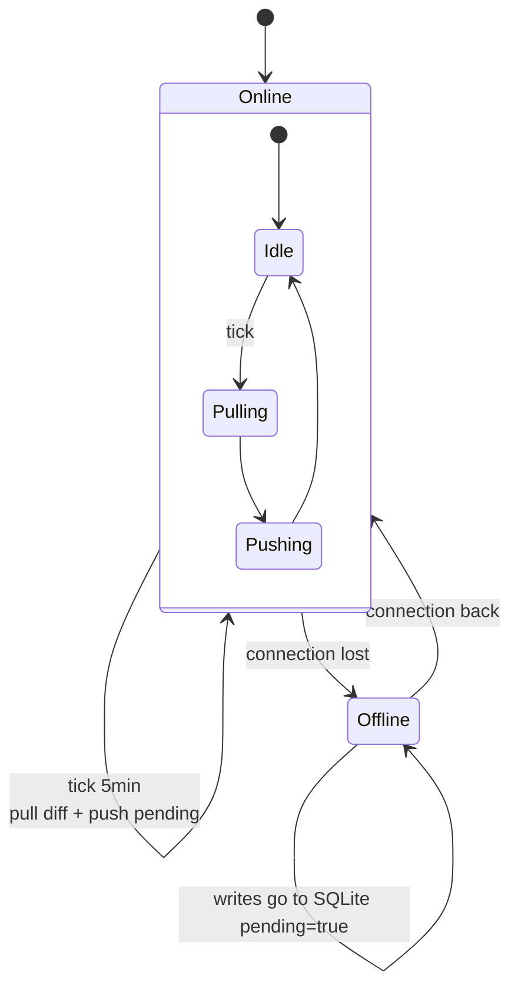
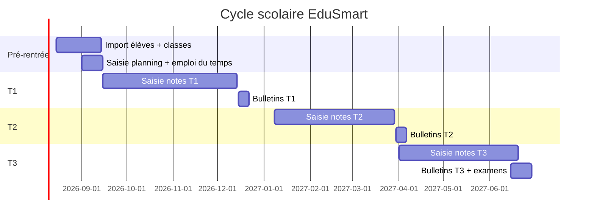

# WORKFLOWS — EduSmart

> Workflows opérationnels (dev, déploiement, support, ajout d'école, support utilisateur).
> Sert de référence pour automatiser ce qui peut l'être et standardiser ce qui ne l'est pas encore.

---

## 1. Workflow de développement quotidien



### Conventions
- Branches : `feature/<short>`, `fix/<short>`, `chore/<short>`.
- Commits : `feat: add students filter`, `fix(desktop): blank window after build`, `docs: add ADR-008`.
- PR titre = identique au commit principal.
- Max 1 PR ouverte par dev par semaine.

---

## 2. Workflow ajout d'une nouvelle école



**Temps total cible** : < 24h entre demande et accès direction.

> Edge Function `on_school_approved` à créer en [STEP_14](../../tasks/STEP_14.md).

---

## 3. Workflow déploiement (release)



### Checklist release prod
- [ ] PR mergée dans `main` avec review.
- [ ] CI verte sur `main`.
- [ ] Preview prod URL testée manuellement.
- [ ] Backup Supabase fait (Dashboard → Backups → Create).
- [ ] CHANGELOG.md mis à jour.
- [ ] Tag git `v1.x.y` créé.
- [ ] Smoke test post-deploy (login + 1 fetch DB OK).

### Rollback (si KO post-deploy)
1. Vercel Dashboard → Deployments → previous deploy → "Promote to Production".
2. Si DB migration en cause : appliquer migration inverse via SQL Editor.
3. Communiquer aux utilisateurs (banner ou statusapp).

---

## 4. Workflow incident production



### Post-mortem template (24h après incident)
- **Date** :
- **Durée downtime** :
- **Impact utilisateurs** :
- **Cause racine** :
- **Détection** : (alerte auto / signal utilisateur)
- **Résolution** :
- **Action préventive** :
- **Ajouté à** : [BUGS_AND_FIXES](../12-bugs/BUGS_AND_FIXES.md)

---

## 5. Workflow saisie de notes (utilisateur enseignant)

```mermaid
flowchart LR
    T[Teacher se connecte] --> A[/admin/grades]
    A --> B[Sélectionne classe + matière + période]
    B --> C[Grille élèves]
    C --> D[Saisit notes]
    D --> E[Server Action recordGrade × N]
    E --> F[RLS check organization_id]
    F --> G[INSERT grades]
    G --> H[Trigger update_student_average]
    H --> I[Realtime push parents]
    I --> J[Notif Expo]
```

**Cas offline** (desktop) :
```
Saisie → SQLite local (pending_sync=true)
       → worker sync 5min → batch upload Supabase
       → INSERT grades → mêmes triggers Realtime
```

---

## 6. Workflow génération IA (admin)



---

## 7. Workflow sync offline desktop



**Détails** :
- **Pull** : `SELECT * FROM <table> WHERE updated_at > last_sync_at AND organization_id = ?`
- **Push** : `SELECT * FROM <local_table> WHERE pending_sync = true` → POST Supabase → mark synced.
- **Conflit** : `last-write-wins` sur `updated_at` (timestamp UTC).

---

## 8. Workflow onboarding nouvel utilisateur (parent)

```mermaid
flowchart LR
    P[Parent] --> S[Visite strelitzia.edusmart.site]
    S --> C[Page contact "Inscrire mon enfant"]
    C --> D[Formulaire envoyé]
    D --> E[Email reçu directrice]
    E --> F[Directrice valide en admin]
    F --> G[Crée auth.users parent + profile role=parent]
    G --> H[Email Magic Link parent]
    H --> I[Parent click → /dashboard]
    I --> J[Voit ses enfants + notes]
```

---

## 9. Workflow Claude Code (session)

> Inspiré du `EduSmart_VibeCoding_Guide.md`.

```mermaid
flowchart LR
    A[Choisir 1 STEP unique] --> B[Lire le STEP en entier]
    B --> C[Ouvrir terminal claude]
    C --> D[Copier-coller le STEP comme prompt]
    D --> E[Claude code + propose patch]
    E --> F[Review diff]
    F --> G{OK ?}
    G -->|Non| H[Demander correction]
    H --> E
    G -->|Oui| I[pnpm dev + test manuel]
    I --> J[Commit avec message conventional]
    J --> K[Push + PR ou direct si solo]
    K --> L[Marquer STEP "✅" dans TASKS_GLOBAL]
```

**Règle d'or** : **1 session Claude = 1 STEP = 1 commit**.

---

## 10. Workflow support utilisateur (post-pilote)

| Canal | Usage | SLA cible |
|---|---|---|
| Email `contact@edusmart.site` | Demandes B2B (directeurs prospects) | 24h |
| Email `support@edusmart.site` | Bugs / questions utilisateurs | 48h |
| Discord server (privé pilote) | Échanges directs avec écoles pilotes | 4h en semaine |
| WhatsApp (Madagascar uniquement) | Urgence locale | 2h |

**Tools** :
- **Linear** ou **GitHub Issues** pour tracker tickets.
- **Cal.com** pour réserver session de démo.
- **Loom** pour réponses vidéo (formation rapide).

---

## 11. Workflow scolaire annuel (long terme)



---

## 12. Automatisations recommandées (P3)

| Workflow | Outil | Effort |
|---|---|---|
| Cron détection décrochage hebdo | Supabase Edge Functions | 4h |
| Email récap quotidien parent | Resend + Edge Function | 3h |
| Export CSV bulletins fin de trimestre | Server Action + Supabase Storage | 2h |
| Sync auto Google Calendar (emploi du temps) | API Google + Edge Function | 8h |
| Webhook Stripe abonnement écoles | Route Handler `/api/webhooks/stripe` | 4h |

---

## 13. Liens

- 🗺️ [ROADMAP](../10-roadmap/ROADMAP.md)
- 📋 [TASKS_GLOBAL](../11-tasks/TASKS_GLOBAL.md)
- 🔁 [Workflow de session Claude — VibeCoding Guide](../17-ai-analysis/AI_CONVERSATION_SUMMARY.md)
- 🗂️ [MASTER_INDEX](../MASTER_INDEX.md)
