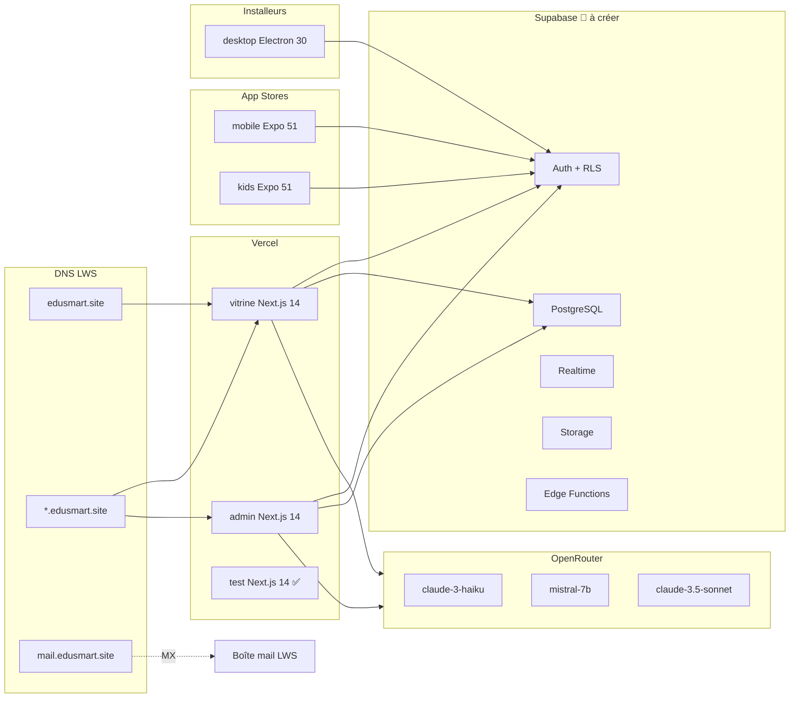

# MASTER INDEX — EduSmart

> Plateforme SaaS multi-tenant de gouvernance scolaire et d'apprentissage adaptatif assisté par IA.
> **Mémoire de Master Informatique** — Université Adventiste Zürcher (UAZ) — Randrianarison Dieu Donné.
> Index central de la documentation. Dernière mise à jour : **2026-05-25**.

---

## 🎯 État du projet en 30 secondes

| Dimension | État | Détail |
|---|---|---|
| **Vision** | ✅ Claire | Plateforme multi-école adaptable (Madagascar puis Afrique francophone) |
| **Infra DNS / Domaine** | ✅ En place | `edusmart.site` (LWS) + Vercel + wildcard `*.edusmart.site` opérationnel |
| **Monorepo Turborepo** | ✅ Initialisé | 6 apps + 2 packages, pnpm workspace, CI minimale |
| **App `test`** | ✅ LIVE | `test.edusmart.site` déployé et fonctionnel |
| **App `vitrine`** | 🟡 Squelette | Routes + composants mais data mockée, pas d'auth |
| **App `admin`** | 🟡 Squelette | Login hardcoded, dashboard mock, IA mockée |
| **App `desktop`** | 🟡 UI OK | Dashboard shadcn complet, sync offline préparée (pas branchée) |
| **Apps `mobile` & `kids`** | 🔴 Stubs Expo | Aucun code métier |
| **Supabase** | 🔴 Non créé | Projet pas encore initialisé, 0 table, 0 RLS |
| **Authentification** | 🔴 Critique | Login admin = mock hardcodé (`directeur@strelitzia.test`) |
| **Tests automatisés** | 🔴 Aucun | CI = build + type-check sur `apps/test` uniquement |
| **Sécurité** | 🔴 Critique | `.env.example` contient potentiellement des secrets réels (LEAK) |
| **Documentation** | ✅ Excellente | 30+ docs Phase Finale (vous êtes ici) |

**Score global** : **5.5/10** → cible **8.3/10** en 12 semaines.
Voir [FINAL_ANALYSIS_REPORT](FINAL_ANALYSIS_REPORT.md) pour le bilan détaillé.

---

## 📚 Documentation — Carte complète des fichiers

### 🏠 Documents centraux
- 🔚 [**FINAL_ANALYSIS_REPORT**](FINAL_ANALYSIS_REPORT.md) — **Rapport final avec scores, recommandations, plan d'action 12 semaines**
- 🗂️ [MASTER_INDEX](MASTER_INDEX.md) — Ce fichier

### 📘 Vue d'ensemble (`01-overview/`)
- [PROJECT_OVERVIEW](01-overview/PROJECT_OVERVIEW.md) — Vision, objectifs, utilisateurs, 6 apps, impacts attendus
- [CURRENT_STATE](01-overview/CURRENT_STATE.md) — Inventaire factuel : codé / mock / manquant / incohérences

### 🏗️ Architecture (`02-architecture/`)
- [ARCHITECTURE](02-architecture/ARCHITECTURE.md) — Monorepo, multi-tenancy, flux middleware, RLS, sessions, diagrammes Mermaid
- [STACK](02-architecture/STACK.md) — Stack technologique complète (Next 14, Expo 51, Electron 30, Supabase, OpenRouter…)

### ⚙️ Setup (`03-setup/`)
- [SETUP_GUIDE](03-setup/SETUP_GUIDE.md) — Installer et lancer en local
- [ENV_VARIABLES](03-setup/ENV_VARIABLES.md) — Référence complète des variables d'environnement

### 🗄️ Backend
- [DATABASE_SCHEMA](04-database/DATABASE_SCHEMA.md) — 12 tables, RLS, indexes, ER diagram
- [API_REFERENCE](05-api/API_REFERENCE.md) — Server Actions + Route Handlers + Webhooks
- [AUTH_FLOW](08-authentication/AUTH_FLOW.md) — Flux d'authentification 6 rôles × 3 surfaces

### 🚀 Déploiement (`09-deployment/`)
- [DEPLOYMENT](09-deployment/DEPLOYMENT.md) — Vercel + EAS + electron-builder + Supabase + LWS

### 🗺️ Roadmap & tâches
- [ROADMAP](10-roadmap/ROADMAP.md) — 5 semaines × 35 tâches + extensions
- [NEXT_ACTIONS](10-roadmap/NEXT_ACTIONS.md) — Actions P0–P3, blockers à lever
- [TASKS_GLOBAL](11-tasks/TASKS_GLOBAL.md) — Tableau récap toutes les tâches

### 🐛 Qualité
- [BUGS_AND_FIXES](12-bugs/BUGS_AND_FIXES.md) — 7 bugs documentés avec solutions
- [TECH_DEBT](12-bugs/TECH_DEBT.md) — 17 dettes identifiées + plan remboursement (~43h)

### 🧠 Décisions (`13-decisions/`)
- [README ADR](13-decisions/README.md) — Index
- [ADR-001](13-decisions/ADR-001-monorepo.md) — Monorepo Turborepo + pnpm
- [ADR-002](13-decisions/ADR-002-nextjs-app-router.md) — Next.js 14 App Router
- [ADR-003](13-decisions/ADR-003-supabase.md) — Supabase tout-en-un
- [ADR-004](13-decisions/ADR-004-multi-tenancy.md) — Multi-tenancy par sous-domaine
- [ADR-005](13-decisions/ADR-005-openrouter.md) — OpenRouter pour l'IA
- [ADR-006](13-decisions/ADR-006-expo.md) — Expo SDK 51 mobile
- [ADR-007](13-decisions/ADR-007-electron.md) — Electron desktop offline
- [ADR-008](13-decisions/ADR-008-google-oauth-unique.md) — 1 Google OAuth pour toutes écoles
- [ADR-009](13-decisions/ADR-009-vercel.md) — Vercel hébergement web
- [ADR-010](13-decisions/ADR-010-dns-lws.md) — DNS LWS conservé

### 🛡️ Sécurité & performance
- [SECURITY_REPORT](14-security/SECURITY_REPORT.md) — Audit complet (score 2/10) + 11 vulns + plan remédiation
- [PERFORMANCE_REPORT](15-performance/PERFORMANCE_REPORT.md) — 10 optimisations + budget perf
- [TESTING](16-testing/TESTING.md) — Stratégie + Vitest + Playwright

### 🤖 IA & workflows
- [AI_CONVERSATION_SUMMARY](17-ai-analysis/AI_CONVERSATION_SUMMARY.md) — Synthèse des 8 exports IA (vision, décisions, citations)
- [WORKFLOWS](18-workflows/WORKFLOWS.md) — Dev, release, incident, ajout école, Claude session…

### 📌 Étapes exécutables séquentielles (`/tasks/`)

> **15 STEPS** prêts à exécuter, dans l'ordre. Chacun contient : objectif / fichiers / dépendances / commandes / risques / checklist / validation.

- [STEP_01](../tasks/STEP_01.md) — 🔴 P0 — Créer Supabase + 12 tables + RLS + seed + Auth
- [STEP_02](../tasks/STEP_02.md) — 🔴 P0 — Sécuriser les secrets (audit + rotation)
- [STEP_03](../tasks/STEP_03.md) — 🔴 P0 — Client Supabase dans `@edusmart/shared`
- [STEP_04](../tasks/STEP_04.md) — 🟠 P1 — Auth réelle (remplacer login mock)
- [STEP_05](../tasks/STEP_05.md) — 🟠 P1 — Vitrine connectée à Supabase
- [STEP_06](../tasks/STEP_06.md) — 🟠 P1 — Admin connecté (students, grades, settings)
- [STEP_07](../tasks/STEP_07.md) — 🟡 P2 — `/api/ai/generate` réel via OpenRouter
- [STEP_08](../tasks/STEP_08.md) — 🟡 P2 — App mobile (login + tabs + notes)
- [STEP_09](../tasks/STEP_09.md) — 🟡 P2 — App kids (QR/PIN + mini-jeux)
- [STEP_10](../tasks/STEP_10.md) — 🟡 P2 — Sync offline desktop (IPC + SQLite + worker)
- [STEP_11](../tasks/STEP_11.md) — 🟢 P3 — Génération bulletins PDF
- [STEP_12](../tasks/STEP_12.md) — 🟡 P2 — Notifications push (Realtime + Expo)
- [STEP_13](../tasks/STEP_13.md) — 🟢 P3 — Tests automatisés (Vitest + Playwright)
- [STEP_14](../tasks/STEP_14.md) — 🟢 P3 — CI étendue + Sentry + rate-limit + Edge Functions
- [STEP_15](../tasks/STEP_15.md) — 🟢 P3 — Déploiement production + migration `edusmart.mg`

---

## 🗺️ Graphe rapide d'architecture



---

## 🛠️ Commandes utiles

```bash
# Installation (depuis la racine)
pnpm install

# Dev — toutes les apps en parallèle
pnpm dev

# Dev — app spécifique
pnpm --filter @edusmart/admin dev
pnpm --filter @edusmart/vitrine dev
pnpm --filter @edusmart/desktop dev
pnpm --filter @edusmart/test dev

# Tests multi-tenant en local
# Vitrine racine (marketing) :
http://localhost:3001
# Vitrine d'une école :
http://localhost:3001?school=strelitzia
http://localhost:3001?school=uaz
# Admin d'une école :
http://localhost:3002?school=strelitzia

# Type-check / build
pnpm -r type-check
pnpm --filter @edusmart/admin build
pnpm --filter @edusmart/vitrine build

# Desktop — build production
pnpm --filter @edusmart/desktop build

# Tests (après STEP_13)
pnpm test
pnpm test:e2e
```

---

## 🚦 Tâches prioritaires (extrait de [NEXT_ACTIONS](10-roadmap/NEXT_ACTIONS.md))

| Priorité | Action | Bloque |
|---|---|---|
| **P0** | Retirer / régénérer les secrets exposés dans `.env.example` | Toute mise en prod sûre |
| **P0** | Créer le projet Supabase + exécuter le script SQL des 12 tables | Toute persistance réelle |
| **P0** | Implémenter `packages/shared/src/supabase/client.ts` (browser + server) | Tous les fetches DB |
| **P1** | Remplacer le login admin hardcodé par Supabase Auth | Toute sécurité réelle |
| **P1** | Brancher vitrine sur Supabase (programs, news, organizations) | Démo crédible |
| **P1** | Créer `CLAUDE.md` racine + sous-CLAUDE.md par app | Discipline session Claude |
| **P2** | Implémenter `apps/admin/api/ai/generate` réel via OpenRouter | Génération leçons / quiz |
| **P2** | Démarrer `apps/mobile` (login + tabs + écran notes) | App parents |
| **P3** | Génération bulletins PDF, rate-limit chat, monitoring Sentry | Polish prod |

---

## 📂 Convention des dossiers

```
EduSmart/
├── apps/
│   ├── admin/      # Portail directeur/secrétariat (Next.js 14)
│   ├── vitrine/    # Site marketing + portail familles (Next.js 14)
│   ├── desktop/    # Client secrétariat offline (Electron 30)
│   ├── mobile/     # App parents/élèves (Expo 51)
│   ├── kids/       # App enfants 6-14 ans gamifiée (Expo 51)
│   └── test/       # Sandbox de debug DNS/middleware (Next.js 14, déployé)
├── packages/
│   ├── shared/     # Types, client Supabase, utils, mocks
│   └── ui/         # Design tokens (couleurs, fonts) — stub
├── docs/           # ← Documentation structurée (vous êtes ici)
│   ├── 01-overview/      02-architecture/     03-setup/
│   ├── 04-database/      05-api/              06-frontend/
│   ├── 07-backend/       08-authentication/   09-deployment/
│   ├── 10-roadmap/       11-tasks/            12-bugs/
│   ├── 13-decisions/     14-security/         15-performance/
│   ├── 16-testing/       17-ai-analysis/      18-workflows/
│   ├── MASTER_INDEX.md
│   └── FINAL_ANALYSIS_REPORT.md
└── tasks/          # ← Étapes d'exécution séquentielles STEP_01..15.md
```

---

## ⚠️ Notes importantes

- Le lien Claude.ai partagé (`claude.ai/share/f4c64682-...`) **n'est pas accessible** (auth requise). L'analyse s'appuie sur les **8 exports locaux** (5 conversations + guide VibeCoding + rapport desktop + backup DNS).
- **Aucun fichier source n'a été supprimé** — refactors et déplacements sont proposés, pas exécutés.
- La date de référence est **2026-05-25**.
- Tous les diagrammes utilisent **Mermaid** (rendus nativement sur GitHub).

---

## ➡️ Prochaine action concrète

1. Lire [FINAL_ANALYSIS_REPORT](FINAL_ANALYSIS_REPORT.md) (~10 min).
2. Ouvrir [tasks/STEP_02.md](../tasks/STEP_02.md) — auditer les secrets (30 min).
3. Enchaîner sur [tasks/STEP_01.md](../tasks/STEP_01.md) — créer Supabase (4-6h).

---

_Documentation générée dans le cadre de l'audit Phase Finale. Voir [PROJECT_OVERVIEW](01-overview/PROJECT_OVERVIEW.md) pour le contexte complet._
