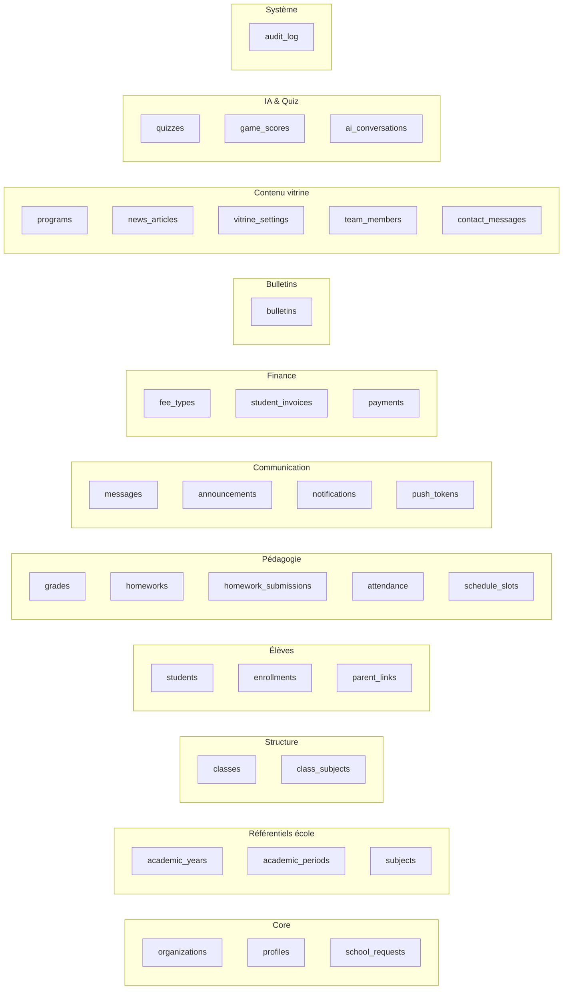

# STEP 01 — Créer le schéma Supabase complet (RESET + 30 tables + RLS + Storage + Seed)

> **Priorité** : 🔴 P0 — Bloque tout le reste.
> **Estimation** : 4-6 heures (création projet, SQL, seed, Auth).
> **Ordre** : 1ʳᵉ étape de la phase fondations.
>
> **🆕 Mise à jour 2026-05-25** : schéma enrichi avec gestion complète des **classes** (groupes d'élèves + responsable), **images de profil** (élèves/classes/équipe), **emploi du temps**, **devoirs**, **présences**, **bulletins**, **finances**, **messagerie**.

---

## 🎯 Objectif

Avoir un projet Supabase opérationnel avec :
- **Reset propre** des 5 tables existantes (organizations, school_requests, profiles, programs, news_articles).
- **30 tables** créées proprement (référentiels + structure école + pédagogie + finance + communication + système).
- **RLS** active partout avec policies cohérentes (multi-tenant par `organization_id`).
- **5 Storage buckets** (logos, avatars, class_covers, news_covers, bulletins).
- **Auth Supabase** configurée (Email + Google + SMTP Resend).
- **Seed riche** : 2 écoles + 2 années + 6 périodes + 12 matières + 4 classes + ~10 élèves + ~20 notes.

> **État Supabase actuel** (vérifié via MCP) :
> - Projet ID : `heuaaqjrrctamhmrsecu` — région `eu-west-1`
> - 5 tables existantes (toutes seront recréées proprement)
> - 2 organizations seedées : STRELITZIA (Toamasina), UAZ (Antsirabe)
> - ⚠️ `school_requests` actuellement **sans RLS** (vulnérabilité — corrigée ici)

---

## 📦 Vue d'ensemble des 30 tables



---

## ⚙️ Procédure

### Étape A — Projet Supabase

Déjà fait. Le projet existe :
```
Project ID : heuaaqjrrctamhmrsecu
URL        : https://heuaaqjrrctamhmrsecu.supabase.co
Region     : eu-west-1 (Ireland)
```

> ℹ️ Le guide originel recommandait Singapore (latence Madagascar). En pratique, eu-west-1 reste correct (~250 ms). Si besoin de migrer plus tard, voir [DEPLOYMENT.md](../docs/09-deployment/DEPLOYMENT.md).

### Étape B — Récupérer les 3 clés

Dashboard Supabase → Project Settings → API :
- `Project URL` → `NEXT_PUBLIC_SUPABASE_URL`
- `anon public key` → `NEXT_PUBLIC_SUPABASE_ANON_KEY`
- `service_role secret` → `SUPABASE_SERVICE_ROLE_KEY` (**ne JAMAIS exposer côté client**)

Les coller dans `.env` racine + Vercel env vars.

### Étape C — Exécuter le SQL en 3 blocs

> **Recommandé** : copier-coller dans Supabase Dashboard → SQL Editor → New query → "Run".
> **Alternative** : appliquer via MCP (`mcp__supabase__apply_migration`) — voir fin de doc.

#### 📜 BLOC 1 — Reset + structure complète (drop & create)

```sql
-- ============================================================
-- 0. CLEAN SLATE — DROP des tables existantes
-- (CASCADE supprime aussi les FK et policies dépendantes)
-- ============================================================
drop table if exists public.audit_log              cascade;
drop table if exists public.ai_conversations       cascade;
drop table if exists public.game_scores            cascade;
drop table if exists public.quizzes                cascade;
drop table if exists public.school_requests        cascade;
drop table if exists public.contact_messages       cascade;
drop table if exists public.team_members           cascade;
drop table if exists public.vitrine_settings       cascade;
drop table if exists public.news_articles          cascade;
drop table if exists public.programs               cascade;
drop table if exists public.bulletins              cascade;
drop table if exists public.payments               cascade;
drop table if exists public.student_invoices       cascade;
drop table if exists public.fee_types              cascade;
drop table if exists public.push_tokens            cascade;
drop table if exists public.notifications          cascade;
drop table if exists public.announcements          cascade;
drop table if exists public.messages               cascade;
drop table if exists public.schedule_slots         cascade;
drop table if exists public.attendance             cascade;
drop table if exists public.homework_submissions   cascade;
drop table if exists public.homeworks              cascade;
drop table if exists public.grades                 cascade;
drop table if exists public.parent_links           cascade;
drop table if exists public.enrollments            cascade;
drop table if exists public.students               cascade;
drop table if exists public.class_subjects         cascade;
drop table if exists public.classes                cascade;
drop table if exists public.subjects               cascade;
drop table if exists public.academic_periods       cascade;
drop table if exists public.academic_years         cascade;
drop table if exists public.profiles               cascade;
drop table if exists public.organizations          cascade;

drop function if exists public.current_user_organization_id() cascade;
drop function if exists public.current_user_role()            cascade;
drop function if exists public.is_super_admin()               cascade;
drop function if exists public.is_staff()                     cascade;
drop function if exists public.is_parent_of(uuid)             cascade;
drop function if exists public.touch_updated_at()             cascade;

-- ============================================================
-- 1. EXTENSIONS
-- ============================================================
create extension if not exists "uuid-ossp";
create extension if not exists "pgcrypto";  -- bcrypt PIN kids
create extension if not exists "citext";    -- emails case-insensitive

-- Helper trigger : maintient updated_at
create or replace function public.touch_updated_at() returns trigger language plpgsql as $$
begin new.updated_at := now(); return new; end $$;

-- ============================================================
-- 2. CORE — organizations, profiles
-- ============================================================
create table public.organizations (
  id uuid primary key default uuid_generate_v4(),
  slug text unique not null check (slug ~ '^[a-z0-9-]{2,32}$'),
  name text not null,
  legal_name text,
  tagline text,
  description text,
  logo_url text,                   -- 🆕 image logo
  banner_url text,                 -- 🆕 image bannière
  colors jsonb default '{"primary":"#1A4D3A","secondary":"#C9A84C","surface":"#FAFAF8"}'::jsonb,
  address text,
  city text,
  region text,
  country text default 'Madagascar',
  postal_code text,
  phone text,
  email citext,
  website text,
  founded_year integer,
  status text default 'active' check (status in ('active','pending','suspended','archived')),
  plan text default 'free' check (plan in ('free','pro','enterprise')),
  created_at timestamptz default now(),
  updated_at timestamptz default now()
);
create trigger trg_orgs_updated   before update on public.organizations for each row execute function public.touch_updated_at();

create table public.profiles (
  id uuid primary key references auth.users(id) on delete cascade,
  organization_id uuid references public.organizations(id) on delete set null,
  role text not null check (role in ('super_admin','director','teacher','secretary','parent','student')),
  full_name text,
  first_name text,
  last_name text,
  avatar_url text,                 -- 🆕 photo profil
  phone text,
  email citext,
  bio text,
  language text default 'fr',
  timezone text default 'Indian/Antananarivo',
  is_active boolean default true,
  last_seen_at timestamptz,
  created_at timestamptz default now(),
  updated_at timestamptz default now()
);
create trigger trg_profiles_updated before update on public.profiles for each row execute function public.touch_updated_at();

-- ============================================================
-- 3. SCHOOL STRUCTURE — années, périodes, matières, classes
-- ============================================================
create table public.academic_years (
  id uuid primary key default uuid_generate_v4(),
  organization_id uuid not null references public.organizations(id) on delete cascade,
  name text not null,                    -- "2025-2026"
  starts_on date not null,
  ends_on date not null,
  is_current boolean default false,
  created_at timestamptz default now(),
  unique (organization_id, name)
);

create table public.academic_periods (
  id uuid primary key default uuid_generate_v4(),
  organization_id uuid not null references public.organizations(id) on delete cascade,
  academic_year_id uuid not null references public.academic_years(id) on delete cascade,
  name text not null,                    -- "Trimestre 1"
  kind text not null default 'trimester' check (kind in ('trimester','semester','quarter','custom')),
  ordinal integer not null,              -- 1, 2, 3
  starts_on date not null,
  ends_on date not null,
  is_current boolean default false,
  created_at timestamptz default now(),
  unique (academic_year_id, ordinal)
);

create table public.subjects (
  id uuid primary key default uuid_generate_v4(),
  organization_id uuid not null references public.organizations(id) on delete cascade,
  code text not null,                    -- "MATH", "FR", "SVT"
  name text not null,
  color text default '#1A4D3A',
  icon text,
  default_coefficient numeric default 1,
  is_active boolean default true,
  created_at timestamptz default now(),
  unique (organization_id, code)
);

-- 🆕 CLASSES (groupes d'élèves) avec responsable et image
create table public.classes (
  id uuid primary key default uuid_generate_v4(),
  organization_id uuid not null references public.organizations(id) on delete cascade,
  academic_year_id uuid not null references public.academic_years(id) on delete cascade,
  name text not null,                    -- "6e A"
  level text,                            -- "Collège", "Lycée", "Master 1"
  grade_level text,                      -- "6e", "Terminale", "M1"
  section text,                          -- "A", "B", "S", "ES"
  capacity integer default 30,
  room text,                             -- "Salle 12"
  cover_url text,                        -- 🆕 image classe
  description text,
  homeroom_teacher_id uuid references public.profiles(id) on delete set null,  -- 🆕 RESPONSABLE / prof principal
  created_at timestamptz default now(),
  updated_at timestamptz default now(),
  unique (organization_id, academic_year_id, name)
);
create trigger trg_classes_updated before update on public.classes for each row execute function public.touch_updated_at();

-- 🆕 Lien M2M : une classe a N matières, chaque matière a 1 prof affecté
create table public.class_subjects (
  id uuid primary key default uuid_generate_v4(),
  class_id uuid not null references public.classes(id) on delete cascade,
  subject_id uuid not null references public.subjects(id) on delete cascade,
  teacher_id uuid references public.profiles(id) on delete set null,
  coefficient numeric default 1,
  hours_per_week numeric default 1,
  created_at timestamptz default now(),
  unique (class_id, subject_id)
);

-- ============================================================
-- 4. STUDENTS — élèves, inscriptions, liens parents
-- ============================================================
create table public.students (
  id uuid primary key default uuid_generate_v4(),
  organization_id uuid not null references public.organizations(id) on delete cascade,
  user_id uuid references auth.users(id) on delete set null,  -- profil élève facultatif
  student_code text not null,            -- "STR-2025-042"
  first_name text not null,
  last_name text not null,
  full_name text generated always as (first_name || ' ' || last_name) stored,
  birth_date date,
  gender text check (gender in ('M','F','N')),
  avatar_url text,                       -- 🆕 photo de profil élève
  pin_hash text,                          -- bcrypt(PIN 4 chiffres) — login app kids
  email citext,
  phone text,
  address text,
  city text,
  emergency_contact_name text,
  emergency_contact_phone text,
  medical_notes text,
  status text default 'active' check (status in ('active','watch','inactive','graduated','transferred')),
  enrolled_on date default current_date,
  created_at timestamptz default now(),
  updated_at timestamptz default now(),
  unique (organization_id, student_code)
);
create trigger trg_students_updated before update on public.students for each row execute function public.touch_updated_at();

-- 🆕 Historique : un élève inscrit dans une classe pour une année donnée
create table public.enrollments (
  id uuid primary key default uuid_generate_v4(),
  student_id uuid not null references public.students(id) on delete cascade,
  class_id uuid not null references public.classes(id) on delete cascade,
  academic_year_id uuid not null references public.academic_years(id) on delete cascade,
  enrolled_at timestamptz default now(),
  left_at timestamptz,
  status text default 'active' check (status in ('active','left','expelled','transferred')),
  unique (student_id, academic_year_id)
);

-- 🆕 Lien parent ↔ enfant (M2M, un parent peut avoir N enfants)
create table public.parent_links (
  id uuid primary key default uuid_generate_v4(),
  parent_profile_id uuid not null references public.profiles(id) on delete cascade,
  student_id uuid not null references public.students(id) on delete cascade,
  relation text not null check (relation in ('father','mother','guardian','tutor','other')),
  is_primary boolean default false,
  can_pickup boolean default true,
  created_at timestamptz default now(),
  unique (parent_profile_id, student_id)
);

-- ============================================================
-- 5. PEDAGOGY — notes, devoirs, présence, emploi du temps
-- ============================================================
create table public.grades (
  id uuid primary key default uuid_generate_v4(),
  organization_id uuid not null references public.organizations(id) on delete cascade,
  student_id uuid not null references public.students(id) on delete cascade,
  class_id uuid references public.classes(id) on delete set null,
  subject_id uuid references public.subjects(id) on delete set null,
  period_id uuid references public.academic_periods(id) on delete set null,
  teacher_id uuid references public.profiles(id) on delete set null,
  evaluation_type text default 'control' check (evaluation_type in ('control','homework','exam','oral','project','participation')),
  title text,                              -- "Devoir surveillé n°2"
  value numeric not null check (value >= 0),
  max_value numeric not null default 20 check (max_value > 0),
  coefficient numeric default 1,
  comment text,
  recorded_at timestamptz default now(),
  created_at timestamptz default now()
);

create table public.homeworks (
  id uuid primary key default uuid_generate_v4(),
  organization_id uuid not null references public.organizations(id) on delete cascade,
  class_id uuid not null references public.classes(id) on delete cascade,
  subject_id uuid references public.subjects(id) on delete set null,
  teacher_id uuid references public.profiles(id) on delete set null,
  title text not null,
  description text,
  attachments jsonb default '[]'::jsonb,
  assigned_at timestamptz default now(),
  due_at timestamptz not null,
  is_published boolean default true,
  created_at timestamptz default now()
);

create table public.homework_submissions (
  id uuid primary key default uuid_generate_v4(),
  homework_id uuid not null references public.homeworks(id) on delete cascade,
  student_id uuid not null references public.students(id) on delete cascade,
  content text,
  file_url text,
  submitted_at timestamptz default now(),
  is_late boolean default false,
  score numeric,
  feedback text,
  graded_at timestamptz,
  graded_by uuid references public.profiles(id) on delete set null,
  unique (homework_id, student_id)
);

create table public.attendance (
  id uuid primary key default uuid_generate_v4(),
  organization_id uuid not null references public.organizations(id) on delete cascade,
  student_id uuid not null references public.students(id) on delete cascade,
  class_id uuid references public.classes(id) on delete set null,
  date date not null,
  period text not null check (period in ('morning','afternoon','full_day','custom')),
  status text not null check (status in ('present','absent','late','justified_absent','justified_late')),
  minutes_late integer default 0,
  notes text,
  recorded_by uuid references public.profiles(id) on delete set null,
  created_at timestamptz default now(),
  unique (student_id, date, period)
);

create table public.schedule_slots (
  id uuid primary key default uuid_generate_v4(),
  organization_id uuid not null references public.organizations(id) on delete cascade,
  class_id uuid not null references public.classes(id) on delete cascade,
  subject_id uuid references public.subjects(id) on delete set null,
  teacher_id uuid references public.profiles(id) on delete set null,
  day_of_week smallint not null check (day_of_week between 1 and 7),  -- 1=Lundi
  starts_at time not null,
  ends_at time not null,
  room text,
  notes text,
  effective_from date,
  effective_until date,
  created_at timestamptz default now(),
  check (starts_at < ends_at)
);

-- ============================================================
-- 6. COMMUNICATION — messages, annonces, notifications, push
-- ============================================================
create table public.messages (
  id uuid primary key default uuid_generate_v4(),
  organization_id uuid not null references public.organizations(id) on delete cascade,
  sender_id uuid not null references public.profiles(id) on delete cascade,
  recipient_id uuid not null references public.profiles(id) on delete cascade,
  subject text,
  body text not null,
  parent_message_id uuid references public.messages(id) on delete set null,
  read_at timestamptz,
  sent_at timestamptz default now()
);

create table public.announcements (
  id uuid primary key default uuid_generate_v4(),
  organization_id uuid not null references public.organizations(id) on delete cascade,
  class_id uuid references public.classes(id) on delete cascade,  -- null = école entière
  author_id uuid references public.profiles(id) on delete set null,
  title text not null,
  body text not null,
  audience text default 'all' check (audience in ('all','parents','teachers','students')),
  published_at timestamptz,
  expires_at timestamptz,
  created_at timestamptz default now()
);

create table public.notifications (
  id uuid primary key default uuid_generate_v4(),
  user_id uuid not null references auth.users(id) on delete cascade,
  type text not null,
  title text not null,
  body text,
  action_url text,
  read_at timestamptz,
  created_at timestamptz default now()
);

create table public.push_tokens (
  user_id uuid not null references auth.users(id) on delete cascade,
  token text not null,
  platform text not null check (platform in ('ios','android','web')),
  device_name text,
  created_at timestamptz default now(),
  last_used_at timestamptz,
  primary key (user_id, token)
);

-- ============================================================
-- 7. FINANCE — frais scolarité (devise MGA par défaut)
-- ============================================================
create table public.fee_types (
  id uuid primary key default uuid_generate_v4(),
  organization_id uuid not null references public.organizations(id) on delete cascade,
  name text not null,
  description text,
  amount numeric not null,
  currency text default 'MGA',
  recurrence text default 'one_time' check (recurrence in ('one_time','monthly','quarterly','yearly')),
  is_active boolean default true,
  created_at timestamptz default now()
);

create table public.student_invoices (
  id uuid primary key default uuid_generate_v4(),
  organization_id uuid not null references public.organizations(id) on delete cascade,
  student_id uuid not null references public.students(id) on delete cascade,
  fee_type_id uuid references public.fee_types(id) on delete set null,
  amount_due numeric not null,
  amount_paid numeric default 0,
  currency text default 'MGA',
  due_date date,
  status text default 'pending' check (status in ('pending','partial','paid','overdue','cancelled')),
  notes text,
  created_at timestamptz default now(),
  updated_at timestamptz default now()
);
create trigger trg_invoices_updated before update on public.student_invoices for each row execute function public.touch_updated_at();

create table public.payments (
  id uuid primary key default uuid_generate_v4(),
  organization_id uuid not null references public.organizations(id) on delete cascade,
  invoice_id uuid references public.student_invoices(id) on delete set null,
  student_id uuid references public.students(id) on delete cascade,
  amount numeric not null,
  currency text default 'MGA',
  method text check (method in ('cash','mvola','orange_money','airtel_money','bank_transfer','check','card')),
  reference text,
  paid_at timestamptz default now(),
  recorded_by uuid references public.profiles(id) on delete set null,
  notes text,
  created_at timestamptz default now()
);

-- ============================================================
-- 8. BULLETINS — cache PDF + meta calculées
-- ============================================================
create table public.bulletins (
  id uuid primary key default uuid_generate_v4(),
  organization_id uuid not null references public.organizations(id) on delete cascade,
  student_id uuid not null references public.students(id) on delete cascade,
  period_id uuid not null references public.academic_periods(id) on delete cascade,
  class_id uuid references public.classes(id) on delete set null,
  average numeric,
  rank integer,
  class_size integer,
  mention text,                          -- "Très Bien", "Bien"
  general_comment text,
  pdf_url text,
  generated_at timestamptz,
  finalized_at timestamptz,
  created_at timestamptz default now(),
  unique (student_id, period_id)
);

-- ============================================================
-- 9. CONTENT — vitrine
-- ============================================================
create table public.programs (
  id uuid primary key default uuid_generate_v4(),
  organization_id uuid not null references public.organizations(id) on delete cascade,
  title text not null,
  description text,
  level text,
  duration text,
  cover_url text,                        -- 🆕 image programme
  is_featured boolean default false,
  display_order integer default 0,
  created_at timestamptz default now()
);

create table public.news_articles (
  id uuid primary key default uuid_generate_v4(),
  organization_id uuid not null references public.organizations(id) on delete cascade,
  author_id uuid references public.profiles(id) on delete set null,
  title text not null,
  slug text,
  excerpt text,
  body text,
  cover_url text,                        -- 🆕 image article
  is_published boolean default false,
  published_at timestamptz,
  created_at timestamptz default now(),
  updated_at timestamptz default now()
);
create trigger trg_news_updated before update on public.news_articles for each row execute function public.touch_updated_at();

create table public.vitrine_settings (
  organization_id uuid primary key references public.organizations(id) on delete cascade,
  hero_title text,
  hero_subtitle text,
  hero_image_url text,
  about_text text,
  sections_visible jsonb default '{"about":true,"programs":true,"news":true,"team":true,"contact":true}'::jsonb,
  seo_title text,
  seo_description text,
  seo_image_url text,
  social_facebook text,
  social_instagram text,
  social_youtube text,
  updated_at timestamptz default now()
);
create trigger trg_vitrine_updated before update on public.vitrine_settings for each row execute function public.touch_updated_at();

create table public.team_members (
  id uuid primary key default uuid_generate_v4(),
  organization_id uuid not null references public.organizations(id) on delete cascade,
  full_name text not null,
  role text,
  bio text,
  avatar_url text,                       -- 🆕 photo équipe
  email citext,
  display_order integer default 0,
  is_published boolean default true,
  created_at timestamptz default now()
);

create table public.contact_messages (
  id uuid primary key default uuid_generate_v4(),
  organization_id uuid references public.organizations(id) on delete set null,
  school_slug text,
  name text not null,
  email citext not null,
  phone text,
  subject text,
  message text not null,
  is_handled boolean default false,
  handled_by uuid references public.profiles(id) on delete set null,
  handled_at timestamptz,
  created_at timestamptz default now()
);

create table public.school_requests (
  id uuid primary key default uuid_generate_v4(),
  school_name text not null,
  slug_wanted text not null,
  director_full_name text,
  director_email citext not null,
  director_phone text,
  city text,
  estimated_students integer,
  notes text,
  status text default 'pending' check (status in ('pending','approved','rejected','contacted')),
  processed_by uuid references public.profiles(id) on delete set null,
  processed_at timestamptz,
  created_at timestamptz default now()
);

-- ============================================================
-- 10. AI + QUIZ
-- ============================================================
create table public.quizzes (
  id uuid primary key default uuid_generate_v4(),
  organization_id uuid not null references public.organizations(id) on delete cascade,
  class_id uuid references public.classes(id) on delete set null,
  subject_id uuid references public.subjects(id) on delete set null,
  created_by uuid references public.profiles(id) on delete set null,
  title text not null,
  description text,
  difficulty text default 'medium' check (difficulty in ('easy','medium','hard')),
  estimated_minutes integer default 10,
  questions jsonb not null default '[]'::jsonb,
  cover_url text,
  is_published boolean default false,
  published_at timestamptz,
  created_at timestamptz default now()
);

create table public.game_scores (
  id uuid primary key default uuid_generate_v4(),
  organization_id uuid not null references public.organizations(id) on delete cascade,
  student_id uuid not null references public.students(id) on delete cascade,
  quiz_id uuid references public.quizzes(id) on delete set null,
  score numeric not null,
  max_score numeric default 100,
  duration_seconds integer,
  answers jsonb,
  played_at timestamptz default now()
);

create table public.ai_conversations (
  id uuid primary key default uuid_generate_v4(),
  organization_id uuid references public.organizations(id) on delete set null,
  user_id uuid references auth.users(id) on delete set null,
  title text,
  task_type text,                        -- "lesson", "quiz", "chat"
  messages jsonb not null default '[]'::jsonb,
  token_usage jsonb,
  created_at timestamptz default now(),
  updated_at timestamptz default now()
);
create trigger trg_aiconv_updated before update on public.ai_conversations for each row execute function public.touch_updated_at();

-- ============================================================
-- 11. SYSTEM — audit_log
-- ============================================================
create table public.audit_log (
  id bigserial primary key,
  organization_id uuid references public.organizations(id) on delete set null,
  user_id uuid references auth.users(id) on delete set null,
  action text not null,                  -- "create.student", "update.grade", "login"
  entity_type text,
  entity_id text,
  payload jsonb,
  ip_address inet,
  user_agent text,
  created_at timestamptz default now()
);

-- ============================================================
-- 12. INDEXES (performance)
-- ============================================================
create index idx_profiles_org              on public.profiles(organization_id);
create index idx_profiles_role             on public.profiles(role);
create index idx_classes_org_year          on public.classes(organization_id, academic_year_id);
create index idx_classes_homeroom          on public.classes(homeroom_teacher_id);
create index idx_class_subjects_teacher    on public.class_subjects(teacher_id);
create index idx_students_org              on public.students(organization_id);
create index idx_students_status           on public.students(organization_id, status);
create index idx_students_user             on public.students(user_id);
create index idx_enrollments_class         on public.enrollments(class_id);
create index idx_enrollments_year          on public.enrollments(academic_year_id);
create index idx_parent_links_parent       on public.parent_links(parent_profile_id);
create index idx_parent_links_student      on public.parent_links(student_id);
create index idx_grades_student            on public.grades(student_id);
create index idx_grades_org_period         on public.grades(organization_id, period_id);
create index idx_grades_class_subject      on public.grades(class_id, subject_id);
create index idx_homeworks_class_due       on public.homeworks(class_id, due_at);
create index idx_attendance_student_date   on public.attendance(student_id, date);
create index idx_schedule_class_day        on public.schedule_slots(class_id, day_of_week);
create index idx_messages_recipient_unread on public.messages(recipient_id, read_at);
create index idx_notifications_user_unread on public.notifications(user_id, read_at);
create index idx_invoices_student_status   on public.student_invoices(student_id, status);
create index idx_news_org_published        on public.news_articles(organization_id, is_published);
create index idx_audit_org_time            on public.audit_log(organization_id, created_at desc);

-- ============================================================
-- 13. HELPER FUNCTIONS pour RLS
-- ============================================================
create or replace function public.current_user_organization_id() returns uuid
  language sql stable security definer set search_path = public as
$$ select organization_id from public.profiles where id = auth.uid() $$;

create or replace function public.current_user_role() returns text
  language sql stable security definer set search_path = public as
$$ select role from public.profiles where id = auth.uid() $$;

create or replace function public.is_super_admin() returns boolean
  language sql stable security definer set search_path = public as
$$ select exists(select 1 from public.profiles where id = auth.uid() and role = 'super_admin') $$;

create or replace function public.is_staff() returns boolean
  language sql stable security definer set search_path = public as
$$ select exists(select 1 from public.profiles where id = auth.uid() and role in ('super_admin','director','teacher','secretary')) $$;

create or replace function public.is_parent_of(student_uuid uuid) returns boolean
  language sql stable security definer set search_path = public as
$$
  select exists(
    select 1 from public.parent_links pl
    where pl.parent_profile_id = auth.uid() and pl.student_id = student_uuid
  )
$$;
```

#### 🛡️ BLOC 2 — RLS (Row-Level Security) sur les 30 tables

```sql
-- Activation RLS partout
alter table public.organizations        enable row level security;
alter table public.profiles             enable row level security;
alter table public.academic_years       enable row level security;
alter table public.academic_periods     enable row level security;
alter table public.subjects             enable row level security;
alter table public.classes              enable row level security;
alter table public.class_subjects       enable row level security;
alter table public.students             enable row level security;
alter table public.enrollments          enable row level security;
alter table public.parent_links         enable row level security;
alter table public.grades               enable row level security;
alter table public.homeworks            enable row level security;
alter table public.homework_submissions enable row level security;
alter table public.attendance           enable row level security;
alter table public.schedule_slots       enable row level security;
alter table public.messages             enable row level security;
alter table public.announcements        enable row level security;
alter table public.notifications        enable row level security;
alter table public.push_tokens          enable row level security;
alter table public.fee_types            enable row level security;
alter table public.student_invoices     enable row level security;
alter table public.payments             enable row level security;
alter table public.bulletins            enable row level security;
alter table public.programs             enable row level security;
alter table public.news_articles        enable row level security;
alter table public.vitrine_settings     enable row level security;
alter table public.team_members         enable row level security;
alter table public.contact_messages     enable row level security;
alter table public.school_requests      enable row level security;
alter table public.quizzes              enable row level security;
alter table public.game_scores          enable row level security;
alter table public.ai_conversations     enable row level security;
alter table public.audit_log            enable row level security;

-- ====== LECTURE PUBLIQUE (vitrine) ======
create policy "public_read_orgs"        on public.organizations    for select using (true);
create policy "public_read_programs"    on public.programs         for select using (true);
create policy "public_read_news"        on public.news_articles    for select using (is_published);
create policy "public_read_team"        on public.team_members     for select using (is_published);
create policy "public_read_vitrine"     on public.vitrine_settings for select using (true);

-- ====== ÉCRITURE PUBLIQUE (formulaires) ======
create policy "public_insert_contact"   on public.contact_messages for insert with check (true);
create policy "public_insert_request"   on public.school_requests  for insert with check (true);
create policy "super_admin_read_requests" on public.school_requests for select using (public.is_super_admin());
create policy "super_admin_update_requests" on public.school_requests for update using (public.is_super_admin());

-- ====== PROFILES ======
create policy "profile_self_read"       on public.profiles for select using (
  id = auth.uid()
  or organization_id = public.current_user_organization_id()
  or public.is_super_admin()
);
create policy "profile_self_update"     on public.profiles for update using (id = auth.uid());
create policy "profile_staff_manage"    on public.profiles for all using (
  public.is_super_admin()
  or (public.current_user_role() = 'director' and organization_id = public.current_user_organization_id())
) with check (
  public.is_super_admin()
  or (public.current_user_role() = 'director' and organization_id = public.current_user_organization_id())
);

-- ====== ORGANIZATIONS écriture ======
create policy "org_update_director"     on public.organizations for update using (
  id = public.current_user_organization_id() and public.current_user_role() in ('director','super_admin')
);

-- ====== STAFF & STUDENTS — pattern "même org en lecture/écriture staff" ======
-- (factorisé : 1 policy lecture + 1 policy écriture par table)
-- ACADEMIC YEARS
create policy "ay_read_same_org"    on public.academic_years for select using (organization_id = public.current_user_organization_id() or public.is_super_admin());
create policy "ay_write_staff"      on public.academic_years for all    using (organization_id = public.current_user_organization_id() and public.current_user_role() in ('director','super_admin')) with check (organization_id = public.current_user_organization_id());

-- ACADEMIC PERIODS
create policy "ap_read_same_org"    on public.academic_periods for select using (organization_id = public.current_user_organization_id() or public.is_super_admin());
create policy "ap_write_staff"      on public.academic_periods for all    using (organization_id = public.current_user_organization_id() and public.current_user_role() in ('director','super_admin')) with check (organization_id = public.current_user_organization_id());

-- SUBJECTS
create policy "sub_read_same_org"   on public.subjects for select using (organization_id = public.current_user_organization_id() or public.is_super_admin());
create policy "sub_write_staff"     on public.subjects for all    using (organization_id = public.current_user_organization_id() and public.current_user_role() in ('director','secretary','super_admin')) with check (organization_id = public.current_user_organization_id());

-- CLASSES
create policy "cls_read_same_org"   on public.classes for select using (organization_id = public.current_user_organization_id() or public.is_super_admin());
create policy "cls_write_staff"     on public.classes for all    using (organization_id = public.current_user_organization_id() and public.current_user_role() in ('director','secretary','super_admin')) with check (organization_id = public.current_user_organization_id());

-- CLASS_SUBJECTS (via la classe)
create policy "cs_read_same_org"    on public.class_subjects for select using (
  exists (select 1 from public.classes c where c.id = class_id and (c.organization_id = public.current_user_organization_id() or public.is_super_admin()))
);
create policy "cs_write_staff"      on public.class_subjects for all using (
  exists (select 1 from public.classes c where c.id = class_id and c.organization_id = public.current_user_organization_id())
  and public.current_user_role() in ('director','secretary','super_admin')
) with check (
  exists (select 1 from public.classes c where c.id = class_id and c.organization_id = public.current_user_organization_id())
);

-- STUDENTS — staff voit tout, parent voit ses enfants, élève voit son profil
create policy "stu_read_staff_or_parent_or_self" on public.students for select using (
  (organization_id = public.current_user_organization_id() and public.is_staff())
  or public.is_parent_of(id)
  or user_id = auth.uid()
  or public.is_super_admin()
);
create policy "stu_write_staff"     on public.students for all using (
  organization_id = public.current_user_organization_id()
  and public.current_user_role() in ('director','secretary','super_admin')
) with check (organization_id = public.current_user_organization_id());

-- ENROLLMENTS
create policy "enr_read_same_org"   on public.enrollments for select using (
  exists (select 1 from public.students s where s.id = student_id and (s.organization_id = public.current_user_organization_id() or public.is_super_admin()))
  or public.is_parent_of(student_id)
);
create policy "enr_write_staff"     on public.enrollments for all using (
  exists (select 1 from public.students s where s.id = student_id and s.organization_id = public.current_user_organization_id())
  and public.current_user_role() in ('director','secretary','super_admin')
);

-- PARENT_LINKS
create policy "pl_read_self_or_staff" on public.parent_links for select using (
  parent_profile_id = auth.uid()
  or exists (select 1 from public.students s where s.id = student_id and s.organization_id = public.current_user_organization_id() and public.is_staff())
);
create policy "pl_write_staff"      on public.parent_links for all using (
  exists (select 1 from public.students s where s.id = student_id and s.organization_id = public.current_user_organization_id())
  and public.current_user_role() in ('director','secretary','super_admin')
);

-- GRADES — staff RW, parent/student R
create policy "g_read_staff_or_parent_or_self" on public.grades for select using (
  (organization_id = public.current_user_organization_id() and public.is_staff())
  or public.is_parent_of(student_id)
  or exists (select 1 from public.students s where s.id = student_id and s.user_id = auth.uid())
);
create policy "g_write_teacher_director" on public.grades for all using (
  organization_id = public.current_user_organization_id()
  and public.current_user_role() in ('teacher','director','super_admin')
) with check (organization_id = public.current_user_organization_id());

-- HOMEWORKS
create policy "hw_read_class_members" on public.homeworks for select using (
  organization_id = public.current_user_organization_id()
);
create policy "hw_write_teacher"    on public.homeworks for all using (
  organization_id = public.current_user_organization_id()
  and public.current_user_role() in ('teacher','director','super_admin')
);

-- HOMEWORK_SUBMISSIONS
create policy "hws_read_self_or_staff" on public.homework_submissions for select using (
  exists (select 1 from public.students s where s.id = student_id and s.user_id = auth.uid())
  or public.is_parent_of(student_id)
  or exists (select 1 from public.homeworks h where h.id = homework_id and h.organization_id = public.current_user_organization_id() and public.is_staff())
);
create policy "hws_write_student"   on public.homework_submissions for insert with check (
  exists (select 1 from public.students s where s.id = student_id and s.user_id = auth.uid())
);
create policy "hws_grade_teacher"   on public.homework_submissions for update using (
  exists (select 1 from public.homeworks h where h.id = homework_id and h.organization_id = public.current_user_organization_id() and public.current_user_role() in ('teacher','director','super_admin'))
);

-- ATTENDANCE
create policy "att_read_staff_or_parent" on public.attendance for select using (
  (organization_id = public.current_user_organization_id() and public.is_staff())
  or public.is_parent_of(student_id)
);
create policy "att_write_staff"     on public.attendance for all using (
  organization_id = public.current_user_organization_id()
  and public.current_user_role() in ('teacher','director','secretary','super_admin')
) with check (organization_id = public.current_user_organization_id());

-- SCHEDULE
create policy "sch_read_same_org"   on public.schedule_slots for select using (organization_id = public.current_user_organization_id());
create policy "sch_write_staff"     on public.schedule_slots for all using (
  organization_id = public.current_user_organization_id()
  and public.current_user_role() in ('director','secretary','super_admin')
);

-- MESSAGES (privé, sender ou recipient)
create policy "msg_read_party"      on public.messages for select using (sender_id = auth.uid() or recipient_id = auth.uid());
create policy "msg_send"            on public.messages for insert with check (sender_id = auth.uid() and organization_id = public.current_user_organization_id());
create policy "msg_mark_read"       on public.messages for update using (recipient_id = auth.uid());

-- ANNOUNCEMENTS — lecture même org, écriture staff
create policy "ann_read_same_org"   on public.announcements for select using (organization_id = public.current_user_organization_id());
create policy "ann_write_staff"     on public.announcements for all using (
  organization_id = public.current_user_organization_id()
  and public.current_user_role() in ('teacher','director','super_admin')
);

-- NOTIFICATIONS / PUSH_TOKENS — own only
create policy "notif_own"           on public.notifications for all using (user_id = auth.uid()) with check (user_id = auth.uid());
create policy "push_own"            on public.push_tokens   for all using (user_id = auth.uid()) with check (user_id = auth.uid());

-- FINANCE
create policy "fee_read_same_org"   on public.fee_types for select using (organization_id = public.current_user_organization_id());
create policy "fee_write_staff"     on public.fee_types for all using (
  organization_id = public.current_user_organization_id()
  and public.current_user_role() in ('director','secretary','super_admin')
);
create policy "inv_read_parent_or_staff" on public.student_invoices for select using (
  (organization_id = public.current_user_organization_id() and public.is_staff())
  or public.is_parent_of(student_id)
);
create policy "inv_write_staff"     on public.student_invoices for all using (
  organization_id = public.current_user_organization_id()
  and public.current_user_role() in ('director','secretary','super_admin')
);
create policy "pay_read_parent_or_staff" on public.payments for select using (
  (organization_id = public.current_user_organization_id() and public.is_staff())
  or public.is_parent_of(student_id)
);
create policy "pay_write_staff"     on public.payments for all using (
  organization_id = public.current_user_organization_id()
  and public.current_user_role() in ('director','secretary','super_admin')
);

-- BULLETINS
create policy "bul_read_parent_or_self_or_staff" on public.bulletins for select using (
  (organization_id = public.current_user_organization_id() and public.is_staff())
  or public.is_parent_of(student_id)
  or exists (select 1 from public.students s where s.id = student_id and s.user_id = auth.uid())
);
create policy "bul_write_staff"     on public.bulletins for all using (
  organization_id = public.current_user_organization_id()
  and public.current_user_role() in ('director','teacher','super_admin')
);

-- CONTENT (programs/news/vitrine_settings/team_members) — écriture staff
create policy "prg_write_staff"     on public.programs        for all using (organization_id = public.current_user_organization_id() and public.current_user_role() in ('director','secretary','super_admin'));
create policy "news_write_staff"    on public.news_articles   for all using (organization_id = public.current_user_organization_id() and public.current_user_role() in ('director','teacher','secretary','super_admin'));
create policy "vs_write_director"   on public.vitrine_settings for all using (organization_id = public.current_user_organization_id() and public.current_user_role() in ('director','super_admin'));
create policy "tm_write_staff"      on public.team_members    for all using (organization_id = public.current_user_organization_id() and public.current_user_role() in ('director','secretary','super_admin'));
create policy "cm_read_staff"       on public.contact_messages for select using (
  (organization_id = public.current_user_organization_id() and public.is_staff()) or public.is_super_admin()
);
create policy "cm_update_staff"     on public.contact_messages for update using (
  (organization_id = public.current_user_organization_id() and public.is_staff()) or public.is_super_admin()
);

-- AI + QUIZ
create policy "ai_own"              on public.ai_conversations for all using (user_id = auth.uid()) with check (user_id = auth.uid());
create policy "qz_read_same_org"    on public.quizzes for select using (organization_id = public.current_user_organization_id());
create policy "qz_write_teacher"    on public.quizzes for all using (
  organization_id = public.current_user_organization_id()
  and public.current_user_role() in ('teacher','director','super_admin')
);
create policy "gs_read_self_or_staff" on public.game_scores for select using (
  (organization_id = public.current_user_organization_id() and public.is_staff())
  or exists (select 1 from public.students s where s.id = student_id and (s.user_id = auth.uid() or public.is_parent_of(s.id)))
);
create policy "gs_insert_self"      on public.game_scores for insert with check (
  exists (select 1 from public.students s where s.id = student_id and s.user_id = auth.uid())
);

-- AUDIT — read super_admin + director (same org)
create policy "audit_read"          on public.audit_log for select using (
  public.is_super_admin()
  or (organization_id = public.current_user_organization_id() and public.current_user_role() = 'director')
);
create policy "audit_insert"        on public.audit_log for insert with check (true);
```

#### 🌱 BLOC 3 — Seed (données de test STRELITZIA + UAZ)

```sql
-- ============================================================
-- SEED — 2 écoles + 2 années + 6 périodes + 12 matières + 4 classes + ~10 élèves
-- ============================================================

-- Note : on réinsère les organizations avec les MÊMES UUID que ceux constatés
-- via le MCP, pour éviter de casser d'éventuelles références externes.

insert into public.organizations (id, slug, name, tagline, city, region, country, colors, status) values
  ('0a268283-f057-4e8b-a67f-30b5ef7f23f5', 'strelitzia', 'STRELITZIA SCHOOL',
   'L''école qui révèle vos talents', 'Toamasina', 'Atsinanana', 'Madagascar',
   '{"primary":"#1A4D3A","secondary":"#C9A84C","surface":"#FAFAF8"}'::jsonb, 'active'),
  ('2e18dfcc-b79e-434c-8eab-6b15aed75e8e', 'uaz', 'Université Adventiste Zurcher',
   'Excellence académique chrétienne', 'Antsirabe', 'Vakinankaratra', 'Madagascar',
   '{"primary":"#5B2C6F","secondary":"#F4D03F","surface":"#FDFEFE"}'::jsonb, 'active');

-- Vitrine settings
insert into public.vitrine_settings (organization_id, hero_title, hero_subtitle) values
  ('0a268283-f057-4e8b-a67f-30b5ef7f23f5', 'STRELITZIA SCHOOL', 'Une éducation qui forme des leaders'),
  ('2e18dfcc-b79e-434c-8eab-6b15aed75e8e', 'UAZ',                'Forme tes talents, construis ton avenir');

-- Années scolaires
insert into public.academic_years (id, organization_id, name, starts_on, ends_on, is_current) values
  ('a1111111-1111-1111-1111-111111111111', '0a268283-f057-4e8b-a67f-30b5ef7f23f5', '2025-2026', '2025-09-01', '2026-07-15', true),
  ('a2222222-2222-2222-2222-222222222222', '2e18dfcc-b79e-434c-8eab-6b15aed75e8e', '2025-2026', '2025-09-01', '2026-06-30', true);

-- Périodes (3 trimestres pour STRELITZIA, 2 semestres pour UAZ)
insert into public.academic_periods (organization_id, academic_year_id, name, kind, ordinal, starts_on, ends_on, is_current) values
  ('0a268283-f057-4e8b-a67f-30b5ef7f23f5', 'a1111111-1111-1111-1111-111111111111', 'Trimestre 1', 'trimester', 1, '2025-09-01', '2025-12-15', true),
  ('0a268283-f057-4e8b-a67f-30b5ef7f23f5', 'a1111111-1111-1111-1111-111111111111', 'Trimestre 2', 'trimester', 2, '2026-01-05', '2026-03-30', false),
  ('0a268283-f057-4e8b-a67f-30b5ef7f23f5', 'a1111111-1111-1111-1111-111111111111', 'Trimestre 3', 'trimester', 3, '2026-04-13', '2026-07-15', false),
  ('2e18dfcc-b79e-434c-8eab-6b15aed75e8e', 'a2222222-2222-2222-2222-222222222222', 'Semestre 1',  'semester',  1, '2025-09-01', '2026-01-31', true),
  ('2e18dfcc-b79e-434c-8eab-6b15aed75e8e', 'a2222222-2222-2222-2222-222222222222', 'Semestre 2',  'semester',  2, '2026-02-01', '2026-06-30', false);

-- Matières STRELITZIA (secondaire général)
insert into public.subjects (organization_id, code, name, color, default_coefficient) values
  ('0a268283-f057-4e8b-a67f-30b5ef7f23f5', 'MATH', 'Mathématiques', '#1A4D3A', 4),
  ('0a268283-f057-4e8b-a67f-30b5ef7f23f5', 'FR',   'Français',      '#C9A84C', 4),
  ('0a268283-f057-4e8b-a67f-30b5ef7f23f5', 'SVT',  'SVT',            '#27ae60', 2),
  ('0a268283-f057-4e8b-a67f-30b5ef7f23f5', 'PC',   'Physique-Chimie','#2980b9', 3),
  ('0a268283-f057-4e8b-a67f-30b5ef7f23f5', 'HG',   'Histoire-Géo',   '#8e44ad', 2),
  ('0a268283-f057-4e8b-a67f-30b5ef7f23f5', 'EN',   'Anglais',        '#e67e22', 2),
  ('0a268283-f057-4e8b-a67f-30b5ef7f23f5', 'EPS',  'EPS',            '#e74c3c', 1);

-- Matières UAZ (Master Info)
insert into public.subjects (organization_id, code, name, color, default_coefficient) values
  ('2e18dfcc-b79e-434c-8eab-6b15aed75e8e', 'ALGO',  'Algorithmique avancée', '#5B2C6F', 4),
  ('2e18dfcc-b79e-434c-8eab-6b15aed75e8e', 'IA',    'Intelligence Artificielle', '#F4D03F', 4),
  ('2e18dfcc-b79e-434c-8eab-6b15aed75e8e', 'DB',    'Bases de données',      '#34495e', 3),
  ('2e18dfcc-b79e-434c-8eab-6b15aed75e8e', 'PROJ',  'Projet de Master',      '#16a085', 6),
  ('2e18dfcc-b79e-434c-8eab-6b15aed75e8e', 'MEMO',  'Mémoire',               '#c0392b', 8);

-- Classes (en attendant qu'on ait des profils enseignants, homeroom_teacher_id reste NULL)
insert into public.classes (id, organization_id, academic_year_id, name, level, grade_level, section, capacity, room) values
  ('c1111111-1111-1111-1111-111111111111', '0a268283-f057-4e8b-a67f-30b5ef7f23f5', 'a1111111-1111-1111-1111-111111111111', '6e A',        'Collège', '6e',        'A', 32, 'Salle 12'),
  ('c2222222-2222-2222-2222-222222222222', '0a268283-f057-4e8b-a67f-30b5ef7f23f5', 'a1111111-1111-1111-1111-111111111111', '3e A',        'Collège', '3e',        'A', 28, 'Salle 8'),
  ('c3333333-3333-3333-3333-333333333333', '0a268283-f057-4e8b-a67f-30b5ef7f23f5', 'a1111111-1111-1111-1111-111111111111', 'Terminale S', 'Lycée',  'Terminale', 'S', 24, 'Salle 21'),
  ('c4444444-4444-4444-4444-444444444444', '2e18dfcc-b79e-434c-8eab-6b15aed75e8e', 'a2222222-2222-2222-2222-222222222222', 'Master 1 Info','Université','M1',      'A', 20, 'Amphi 2');

-- Élèves (5 STRELITZIA + 3 UAZ)
insert into public.students (id, organization_id, student_code, first_name, last_name, gender, birth_date, status) values
  ('51111111-1111-1111-1111-111111111111', '0a268283-f057-4e8b-a67f-30b5ef7f23f5', 'STR-2025-001', 'Miora',  'Rakoto',     'F', '2013-04-12', 'active'),
  ('52222222-2222-2222-2222-222222222222', '0a268283-f057-4e8b-a67f-30b5ef7f23f5', 'STR-2025-002', 'Tiana',  'Rabe',       'M', '2013-08-30', 'active'),
  ('53333333-3333-3333-3333-333333333333', '0a268283-f057-4e8b-a67f-30b5ef7f23f5', 'STR-2025-003', 'Anja',   'Randria',    'F', '2010-01-05', 'watch'),
  ('54444444-4444-4444-4444-444444444444', '0a268283-f057-4e8b-a67f-30b5ef7f23f5', 'STR-2025-004', 'Hery',   'Andriantsoa','M', '2007-11-22', 'active'),
  ('55555555-5555-5555-5555-555555555555', '0a268283-f057-4e8b-a67f-30b5ef7f23f5', 'STR-2025-005', 'Lova',   'Rasolofo',   'F', '2008-03-15', 'active'),
  ('61111111-1111-1111-1111-111111111111', '2e18dfcc-b79e-434c-8eab-6b15aed75e8e', 'UAZ-2025-001', 'Dieu Donné','Randrianarison','M','2000-06-10','active'),
  ('62222222-2222-2222-2222-222222222222', '2e18dfcc-b79e-434c-8eab-6b15aed75e8e', 'UAZ-2025-002', 'Sarobidy',  'Andrianina',    'F','2001-02-18','active'),
  ('63333333-3333-3333-3333-333333333333', '2e18dfcc-b79e-434c-8eab-6b15aed75e8e', 'UAZ-2025-003', 'Toky',      'Razafy',        'M','1999-09-25','active');

-- Inscriptions (élève → classe → année)
insert into public.enrollments (student_id, class_id, academic_year_id) values
  ('51111111-1111-1111-1111-111111111111', 'c1111111-1111-1111-1111-111111111111', 'a1111111-1111-1111-1111-111111111111'),
  ('52222222-2222-2222-2222-222222222222', 'c1111111-1111-1111-1111-111111111111', 'a1111111-1111-1111-1111-111111111111'),
  ('53333333-3333-3333-3333-333333333333', 'c2222222-2222-2222-2222-222222222222', 'a1111111-1111-1111-1111-111111111111'),
  ('54444444-4444-4444-4444-444444444444', 'c3333333-3333-3333-3333-333333333333', 'a1111111-1111-1111-1111-111111111111'),
  ('55555555-5555-5555-5555-555555555555', 'c3333333-3333-3333-3333-333333333333', 'a1111111-1111-1111-1111-111111111111'),
  ('61111111-1111-1111-1111-111111111111', 'c4444444-4444-4444-4444-444444444444', 'a2222222-2222-2222-2222-222222222222'),
  ('62222222-2222-2222-2222-222222222222', 'c4444444-4444-4444-4444-444444444444', 'a2222222-2222-2222-2222-222222222222'),
  ('63333333-3333-3333-3333-333333333333', 'c4444444-4444-4444-4444-444444444444', 'a2222222-2222-2222-2222-222222222222');

-- Programmes (vitrine)
insert into public.programs (organization_id, title, description, level, duration, display_order) values
  ('0a268283-f057-4e8b-a67f-30b5ef7f23f5', 'Primaire',         'CP au CM2 — éveil et socle commun', 'Primaire', '5 ans', 1),
  ('0a268283-f057-4e8b-a67f-30b5ef7f23f5', 'Collège',          '6e à 3e — préparation au BEPC',     'Collège',  '4 ans', 2),
  ('0a268283-f057-4e8b-a67f-30b5ef7f23f5', 'Lycée Général',    '2nde à Terminale — bac S, ES, L',   'Lycée',    '3 ans', 3),
  ('0a268283-f057-4e8b-a67f-30b5ef7f23f5', 'Section bilingue', 'Anglais renforcé dès la 6e',         'Collège+Lycée', '7 ans', 4),
  ('2e18dfcc-b79e-434c-8eab-6b15aed75e8e', 'Master Informatique', 'Bac+5 — IA, web, mobile, data', 'Master',   '2 ans', 1),
  ('2e18dfcc-b79e-434c-8eab-6b15aed75e8e', 'Licence Sciences',    'Bac+3 — maths, info, physique',  'Licence',  '3 ans', 2);

-- News (3 articles publiés)
insert into public.news_articles (organization_id, title, slug, excerpt, body, is_published, published_at) values
  ('0a268283-f057-4e8b-a67f-30b5ef7f23f5', 'Rentrée 2025-2026', 'rentree-2025-2026', 'La rentrée scolaire aura lieu le 1er septembre.', 'Cher parents, ...', true, now() - interval '20 days'),
  ('0a268283-f057-4e8b-a67f-30b5ef7f23f5', 'Concours sciences', 'concours-sciences-2025', 'Nos lycéens primés à Antananarivo.', 'Une équipe de STRELITZIA s''est distinguée...', true, now() - interval '7 days'),
  ('2e18dfcc-b79e-434c-8eab-6b15aed75e8e', 'Hackathon UAZ',     'hackathon-uaz-2025', 'Inscriptions ouvertes pour le hackathon annuel.', 'Du 12 au 14 novembre...', true, now() - interval '3 days');

-- Quelques notes test sur les élèves STRELITZIA (sans teacher_id pour l'instant)
do $$
declare
  v_period_id uuid := (select id from public.academic_periods where organization_id='0a268283-f057-4e8b-a67f-30b5ef7f23f5' and ordinal=1);
  v_class_6e  uuid := 'c1111111-1111-1111-1111-111111111111';
  v_class_3e  uuid := 'c2222222-2222-2222-2222-222222222222';
  v_class_term uuid := 'c3333333-3333-3333-3333-333333333333';
  v_math uuid := (select id from public.subjects where organization_id='0a268283-f057-4e8b-a67f-30b5ef7f23f5' and code='MATH');
  v_fr   uuid := (select id from public.subjects where organization_id='0a268283-f057-4e8b-a67f-30b5ef7f23f5' and code='FR');
  v_svt  uuid := (select id from public.subjects where organization_id='0a268283-f057-4e8b-a67f-30b5ef7f23f5' and code='SVT');
begin
  insert into public.grades (organization_id, student_id, class_id, subject_id, period_id, evaluation_type, title, value, max_value, coefficient) values
    ('0a268283-f057-4e8b-a67f-30b5ef7f23f5', '51111111-1111-1111-1111-111111111111', v_class_6e,  v_math, v_period_id, 'control',  'DS n°1', 14, 20, 4),
    ('0a268283-f057-4e8b-a67f-30b5ef7f23f5', '51111111-1111-1111-1111-111111111111', v_class_6e,  v_fr,   v_period_id, 'control',  'Rédaction', 15, 20, 4),
    ('0a268283-f057-4e8b-a67f-30b5ef7f23f5', '51111111-1111-1111-1111-111111111111', v_class_6e,  v_svt,  v_period_id, 'oral',     'Exposé', 16, 20, 2),
    ('0a268283-f057-4e8b-a67f-30b5ef7f23f5', '52222222-2222-2222-2222-222222222222', v_class_6e,  v_math, v_period_id, 'control',  'DS n°1', 11, 20, 4),
    ('0a268283-f057-4e8b-a67f-30b5ef7f23f5', '52222222-2222-2222-2222-222222222222', v_class_6e,  v_fr,   v_period_id, 'control',  'Rédaction', 13, 20, 4),
    ('0a268283-f057-4e8b-a67f-30b5ef7f23f5', '53333333-3333-3333-3333-333333333333', v_class_3e,  v_math, v_period_id, 'exam',     'Brevet blanc', 8, 20, 4),
    ('0a268283-f057-4e8b-a67f-30b5ef7f23f5', '53333333-3333-3333-3333-333333333333', v_class_3e,  v_fr,   v_period_id, 'control',  'Dissertation', 10, 20, 4),
    ('0a268283-f057-4e8b-a67f-30b5ef7f23f5', '54444444-4444-4444-4444-444444444444', v_class_term,v_math, v_period_id, 'exam',     'Bac blanc', 17, 20, 4);
end $$;

-- Frais scolaires exemple
insert into public.fee_types (organization_id, name, amount, currency, recurrence) values
  ('0a268283-f057-4e8b-a67f-30b5ef7f23f5', 'Inscription annuelle',       300000, 'MGA', 'yearly'),
  ('0a268283-f057-4e8b-a67f-30b5ef7f23f5', 'Scolarité mensuelle',         80000, 'MGA', 'monthly'),
  ('0a268283-f057-4e8b-a67f-30b5ef7f23f5', 'Cantine mensuelle',            45000, 'MGA', 'monthly'),
  ('2e18dfcc-b79e-434c-8eab-6b15aed75e8e', 'Frais semestriels Master', 1500000, 'MGA', 'semester'::text);
```

---

### Étape D — Storage buckets (à exécuter dans Dashboard → Storage)

| Bucket | Public ? | Usage |
|---|---|---|
| `logos` | ✅ public | `organizations/<orga_id>/logo.png` |
| `avatars` | ✅ public | `students/<student_id>.png`, `users/<user_id>.png`, `team/<member_id>.png` |
| `class_covers` | ✅ public | `classes/<class_id>.png` 🆕 |
| `news_covers` | ✅ public | `news/<orga_id>/<article_id>.jpg` |
| `bulletins` | 🔴 privé (signed URLs) | `bulletins/<orga_id>/<student_id>/<period_id>.pdf` |

> Création en SQL (optionnelle, sinon Dashboard) :
> ```sql
> insert into storage.buckets (id, name, public) values
>   ('logos',        'logos',        true),
>   ('avatars',      'avatars',      true),
>   ('class_covers', 'class_covers', true),
>   ('news_covers',  'news_covers',  true),
>   ('bulletins',    'bulletins',    false)
> on conflict (id) do nothing;
> ```

### Étape E — Configurer Auth (Dashboard → Authentication → Settings)

```
- Site URL                : https://edusmart.site
- Redirect URLs           : https://*.edusmart.site/**, http://localhost:3001/**, http://localhost:3002/**
- Email confirmations     : ON
- SMTP (Resend) :
    Host     : smtp.resend.com
    Port     : 465
    Username : resend
    Password : <RESEND_API_KEY>
    Sender   : noreply@edusmart.site
- Providers : Email ON (password + magic link), Google ON
```

---

## ⚠️ Risques

| Risque | Mitigation |
|---|---|
| Oubli RLS sur nouvelle table → fuite cross-tenant | Test SQL : `select tablename from pg_tables where schemaname='public' and rowsecurity=false` — doit retourner 0 |
| `SUPABASE_SERVICE_ROLE_KEY` exposée client | Convention nommage stricte, lint custom |
| `pin_hash` faible (PIN 4 chiffres seulement) | OK car le PIN n'est valable qu'avec le `student_code` ; bcrypt cost ≥ 10 |
| Trigger `touch_updated_at` oublié sur nouvelle table | Pattern à reproduire à chaque CREATE TABLE avec `updated_at` |
| Audit_log volumineux à terme | Partitionner par mois en P3 |

---

## ✅ Validation

### Checklist
- [ ] Bloc 1 (CREATE) exécuté sans erreur
- [ ] Bloc 2 (RLS) exécuté sans erreur
- [ ] Bloc 3 (SEED) exécuté sans erreur
- [ ] 5 buckets Storage créés
- [ ] Auth configurée + SMTP testé (email reçu)
- [ ] `.env` racine contient les 3 clés Supabase
- [ ] Vercel env vars à jour

### Tests SQL de validation
```sql
-- 1. Les 30 tables existent
select count(*) as nb_tables from pg_tables where schemaname = 'public';
-- → 30 attendu

-- 2. RLS active sur toutes
select count(*) as no_rls from pg_tables where schemaname = 'public' and rowsecurity = false;
-- → 0 attendu

-- 3. Seed organisations
select slug, name, city from public.organizations order by slug;
-- → strelitzia / STRELITZIA SCHOOL / Toamasina
-- → uaz / Université Adventiste Zurcher / Antsirabe

-- 4. Compteurs seed
select
  (select count(*) from public.academic_years)   as years,    -- 2
  (select count(*) from public.academic_periods) as periods,  -- 5
  (select count(*) from public.subjects)         as subjects, -- 12
  (select count(*) from public.classes)          as classes,  -- 4
  (select count(*) from public.students)         as students, -- 8
  (select count(*) from public.enrollments)      as enrols,   -- 8
  (select count(*) from public.grades)           as grades,   -- 8
  (select count(*) from public.programs)         as programs, -- 6
  (select count(*) from public.news_articles)    as news,     -- 3
  (select count(*) from public.fee_types)        as fees;     -- 4
```

---

## 🤖 Application via MCP Supabase (alternative au copier-coller)

Si tu préfères ne pas copier-coller manuellement, ces blocs SQL peuvent être appliqués directement via l'outil MCP `apply_migration` (3 migrations à passer dans l'ordre : `init_schema`, `init_rls`, `seed_data`). Voir avec Claude.

---

## 📋 Critères de complétude

Cette étape est **terminée** quand :
1. ✅ Les 30 tables existent et la RLS est active partout.
2. ✅ Le seed est en place (8 élèves répartis dans 4 classes, notes, programmes, etc.).
3. ✅ Les 5 buckets Storage sont créés.
4. ✅ Un utilisateur test peut se connecter via Supabase Auth Dashboard.

---

## ➡️ Prochaine étape

→ [STEP_02.md](STEP_02.md) — Sécuriser définitivement les secrets.
→ [STEP_03.md](STEP_03.md) — Implémenter le client Supabase dans `packages/shared` (avec types **regénérés** depuis ce nouveau schéma).
